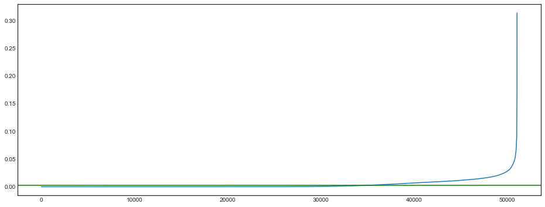

## EDA와 클러스터링을 통한 배틀그라운드 플레이유형 분석

- 데이터 출처 : <a href='https://www.kaggle.com/c/pubg-finish-placement-prediction'> kaggle competition - PUBG Finish Placement Prediction (Kernels Only) </a>
- 게임설명 : '배틀그라운드'는 고립된 섬에서 100명의 인원이 무기와 탈 것을 활용해 최후의 1인이 되기 위해 경쟁을 벌이는 배틀로얄 게임
- 주제 선정 이유 : 
    - 'OO메타'
        - 배틀그라운드 게임에서는 'OO메타'라고 불리는 다양한 플레이스타일이 있다. 
            - 전투를 피하고 자기장을 따라 움직이는 플레이의 자기장메타
            - 적을 찾아 움직이며 전투를 자주하고 그것을 통해 필요한 아이템을 보충하는 여포메타 
        - 유저들이 지향하는 메타에 따라 공격적, 또는 수비적인 행동을 하게되며 이는 플레이 데이터에 기록이 된다. 
        - 인게임 플레이 관련 변수들을 통해 클러스터링함으로써 유저들이 어떤 메타를 주로 지향하는지, 그리고 각 메타별로 얼마나 많은 유저들이 있는지 확인해보고자 한다. 
- 분석 과정
    - median, mean 등의 대푯값을 통해 전역적 특성과 clustering을 통해 각 클러스터의 지역적 특성의 차이를 비교하고자 함.
- 결과 시각화 
    - 또한 클러스터링과 같은 기법을 통해 분석을 진행할 경우 클러스터링 결과를 해석하는 작업이 굉장히 중요하다. 
    - 해당 클러스터가 어떠한 특징을 갖는지, 다른 클러스터와 어떠한 차이점이 나타나는지 등을 확인하는 것이 주요 목적이 되며, 이를 많은 사람들에게 설명하기 위해서는 시각화작업이 중요하다고 생각했다. 
    - 따라서 결과해석에 중점을 두어 시각화를 해 많은 사람들이 이를 결과를 쉽게 이해할 수 있는 방향을 고민했다.

### 0. 데이터 불러오기


```python
import pandas as pd
import numpy as np
import matplotlib.pyplot as plt
pd.options.display.max_columns = 30
import math
import seaborn as sns
plt.style.use('seaborn-white')
import warnings
warnings.filterwarnings('ignore')
```


```python
train = pd.read_csv('./data/train_V2.csv')
train.head(10)
```


<div>
<style scoped>
    .dataframe tbody tr th:only-of-type {
        vertical-align: middle;
    }

    .dataframe tbody tr th {
        vertical-align: top;
    }

    .dataframe thead th {
        text-align: right;
    }
</style>
<table border="1" class="dataframe">
  <thead>
    <tr style="text-align: right;">
      <th></th>
      <th>Id</th>
      <th>groupId</th>
      <th>matchId</th>
      <th>assists</th>
      <th>boosts</th>
      <th>damageDealt</th>
      <th>DBNOs</th>
      <th>headshotKills</th>
      <th>heals</th>
      <th>killPlace</th>
      <th>killPoints</th>
      <th>kills</th>
      <th>killStreaks</th>
      <th>longestKill</th>
      <th>matchDuration</th>
      <th>matchType</th>
      <th>maxPlace</th>
      <th>numGroups</th>
      <th>rankPoints</th>
      <th>revives</th>
      <th>rideDistance</th>
      <th>roadKills</th>
      <th>swimDistance</th>
      <th>teamKills</th>
      <th>vehicleDestroys</th>
      <th>walkDistance</th>
      <th>weaponsAcquired</th>
      <th>winPoints</th>
      <th>winPlacePerc</th>
    </tr>
  </thead>
  <tbody>
    <tr>
      <th>0</th>
      <td>7f96b2f878858a</td>
      <td>4d4b580de459be</td>
      <td>a10357fd1a4a91</td>
      <td>0</td>
      <td>0</td>
      <td>0.000</td>
      <td>0</td>
      <td>0</td>
      <td>0</td>
      <td>60</td>
      <td>1241</td>
      <td>0</td>
      <td>0</td>
      <td>0.00</td>
      <td>1306</td>
      <td>squad-fpp</td>
      <td>28</td>
      <td>26</td>
      <td>-1</td>
      <td>0</td>
      <td>0.0000</td>
      <td>0</td>
      <td>0.00</td>
      <td>0</td>
      <td>0</td>
      <td>244.80</td>
      <td>1</td>
      <td>1466</td>
      <td>0.4444</td>
    </tr>
    <tr>
      <th>1</th>
      <td>eef90569b9d03c</td>
      <td>684d5656442f9e</td>
      <td>aeb375fc57110c</td>
      <td>0</td>
      <td>0</td>
      <td>91.470</td>
      <td>0</td>
      <td>0</td>
      <td>0</td>
      <td>57</td>
      <td>0</td>
      <td>0</td>
      <td>0</td>
      <td>0.00</td>
      <td>1777</td>
      <td>squad-fpp</td>
      <td>26</td>
      <td>25</td>
      <td>1484</td>
      <td>0</td>
      <td>0.0045</td>
      <td>0</td>
      <td>11.04</td>
      <td>0</td>
      <td>0</td>
      <td>1434.00</td>
      <td>5</td>
      <td>0</td>
      <td>0.6400</td>
    </tr>
    <tr>
      <th>2</th>
      <td>1eaf90ac73de72</td>
      <td>6a4a42c3245a74</td>
      <td>110163d8bb94ae</td>
      <td>1</td>
      <td>0</td>
      <td>68.000</td>
      <td>0</td>
      <td>0</td>
      <td>0</td>
      <td>47</td>
      <td>0</td>
      <td>0</td>
      <td>0</td>
      <td>0.00</td>
      <td>1318</td>
      <td>duo</td>
      <td>50</td>
      <td>47</td>
      <td>1491</td>
      <td>0</td>
      <td>0.0000</td>
      <td>0</td>
      <td>0.00</td>
      <td>0</td>
      <td>0</td>
      <td>161.80</td>
      <td>2</td>
      <td>0</td>
      <td>0.7755</td>
    </tr>
    <tr>
      <th>3</th>
      <td>4616d365dd2853</td>
      <td>a930a9c79cd721</td>
      <td>f1f1f4ef412d7e</td>
      <td>0</td>
      <td>0</td>
      <td>32.900</td>
      <td>0</td>
      <td>0</td>
      <td>0</td>
      <td>75</td>
      <td>0</td>
      <td>0</td>
      <td>0</td>
      <td>0.00</td>
      <td>1436</td>
      <td>squad-fpp</td>
      <td>31</td>
      <td>30</td>
      <td>1408</td>
      <td>0</td>
      <td>0.0000</td>
      <td>0</td>
      <td>0.00</td>
      <td>0</td>
      <td>0</td>
      <td>202.70</td>
      <td>3</td>
      <td>0</td>
      <td>0.1667</td>
    </tr>
    <tr>
      <th>4</th>
      <td>315c96c26c9aac</td>
      <td>de04010b3458dd</td>
      <td>6dc8ff871e21e6</td>
      <td>0</td>
      <td>0</td>
      <td>100.000</td>
      <td>0</td>
      <td>0</td>
      <td>0</td>
      <td>45</td>
      <td>0</td>
      <td>1</td>
      <td>1</td>
      <td>58.53</td>
      <td>1424</td>
      <td>solo-fpp</td>
      <td>97</td>
      <td>95</td>
      <td>1560</td>
      <td>0</td>
      <td>0.0000</td>
      <td>0</td>
      <td>0.00</td>
      <td>0</td>
      <td>0</td>
      <td>49.75</td>
      <td>2</td>
      <td>0</td>
      <td>0.1875</td>
    </tr>
    <tr>
      <th>5</th>
      <td>ff79c12f326506</td>
      <td>289a6836a88d27</td>
      <td>bac52627a12114</td>
      <td>0</td>
      <td>0</td>
      <td>100.000</td>
      <td>1</td>
      <td>1</td>
      <td>0</td>
      <td>44</td>
      <td>0</td>
      <td>1</td>
      <td>1</td>
      <td>18.44</td>
      <td>1395</td>
      <td>squad-fpp</td>
      <td>28</td>
      <td>28</td>
      <td>1418</td>
      <td>0</td>
      <td>0.0000</td>
      <td>0</td>
      <td>0.00</td>
      <td>0</td>
      <td>0</td>
      <td>34.70</td>
      <td>1</td>
      <td>0</td>
      <td>0.0370</td>
    </tr>
    <tr>
      <th>6</th>
      <td>95959be0e21ca3</td>
      <td>2c485a1ad3d0f1</td>
      <td>a8274e903927a2</td>
      <td>0</td>
      <td>0</td>
      <td>0.000</td>
      <td>0</td>
      <td>0</td>
      <td>0</td>
      <td>96</td>
      <td>1262</td>
      <td>0</td>
      <td>0</td>
      <td>0.00</td>
      <td>1316</td>
      <td>squad-fpp</td>
      <td>28</td>
      <td>28</td>
      <td>-1</td>
      <td>0</td>
      <td>0.0000</td>
      <td>0</td>
      <td>0.00</td>
      <td>0</td>
      <td>0</td>
      <td>13.50</td>
      <td>1</td>
      <td>1497</td>
      <td>0.0000</td>
    </tr>
    <tr>
      <th>7</th>
      <td>311b84c6ff4390</td>
      <td>eaba5fcb7fc1ae</td>
      <td>292611730ca862</td>
      <td>0</td>
      <td>0</td>
      <td>8.538</td>
      <td>0</td>
      <td>0</td>
      <td>0</td>
      <td>48</td>
      <td>1000</td>
      <td>0</td>
      <td>0</td>
      <td>0.00</td>
      <td>1967</td>
      <td>solo-fpp</td>
      <td>96</td>
      <td>92</td>
      <td>-1</td>
      <td>0</td>
      <td>2004.0000</td>
      <td>0</td>
      <td>0.00</td>
      <td>0</td>
      <td>0</td>
      <td>1089.00</td>
      <td>6</td>
      <td>1500</td>
      <td>0.7368</td>
    </tr>
    <tr>
      <th>8</th>
      <td>1a68204ccf9891</td>
      <td>47cfbb04e1b1a2</td>
      <td>df014fbee741c6</td>
      <td>0</td>
      <td>0</td>
      <td>51.600</td>
      <td>0</td>
      <td>0</td>
      <td>0</td>
      <td>64</td>
      <td>0</td>
      <td>0</td>
      <td>0</td>
      <td>0.00</td>
      <td>1375</td>
      <td>squad</td>
      <td>28</td>
      <td>27</td>
      <td>1493</td>
      <td>0</td>
      <td>0.0000</td>
      <td>0</td>
      <td>0.00</td>
      <td>0</td>
      <td>0</td>
      <td>799.90</td>
      <td>4</td>
      <td>0</td>
      <td>0.3704</td>
    </tr>
    <tr>
      <th>9</th>
      <td>e5bb5a43587253</td>
      <td>759bb6f7514fd2</td>
      <td>3d3031c795305b</td>
      <td>0</td>
      <td>0</td>
      <td>37.270</td>
      <td>0</td>
      <td>0</td>
      <td>0</td>
      <td>74</td>
      <td>0</td>
      <td>0</td>
      <td>0</td>
      <td>0.00</td>
      <td>1930</td>
      <td>squad</td>
      <td>29</td>
      <td>27</td>
      <td>1349</td>
      <td>0</td>
      <td>0.0000</td>
      <td>0</td>
      <td>0.00</td>
      <td>0</td>
      <td>0</td>
      <td>65.67</td>
      <td>1</td>
      <td>0</td>
      <td>0.2143</td>
    </tr>
  </tbody>
</table>
</div>


```python
train.describe()
```


<div>
<style scoped>
    .dataframe tbody tr th:only-of-type {
        vertical-align: middle;
    }

    .dataframe tbody tr th {
        vertical-align: top;
    }

    .dataframe thead th {
        text-align: right;
    }
</style>
<table border="1" class="dataframe">
  <thead>
    <tr style="text-align: right;">
      <th></th>
      <th>assists</th>
      <th>boosts</th>
      <th>damageDealt</th>
      <th>DBNOs</th>
      <th>headshotKills</th>
      <th>heals</th>
      <th>killPlace</th>
      <th>killPoints</th>
      <th>kills</th>
      <th>killStreaks</th>
      <th>longestKill</th>
      <th>matchDuration</th>
      <th>maxPlace</th>
      <th>numGroups</th>
      <th>rankPoints</th>
      <th>revives</th>
      <th>rideDistance</th>
      <th>roadKills</th>
      <th>swimDistance</th>
      <th>teamKills</th>
      <th>vehicleDestroys</th>
      <th>walkDistance</th>
      <th>weaponsAcquired</th>
      <th>winPoints</th>
      <th>winPlacePerc</th>
    </tr>
  </thead>
  <tbody>
    <tr>
      <th>count</th>
      <td>4.446966e+06</td>
      <td>4.446966e+06</td>
      <td>4.446966e+06</td>
      <td>4.446966e+06</td>
      <td>4.446966e+06</td>
      <td>4.446966e+06</td>
      <td>4.446966e+06</td>
      <td>4.446966e+06</td>
      <td>4.446966e+06</td>
      <td>4.446966e+06</td>
      <td>4.446966e+06</td>
      <td>4.446966e+06</td>
      <td>4.446966e+06</td>
      <td>4.446966e+06</td>
      <td>4.446966e+06</td>
      <td>4.446966e+06</td>
      <td>4.446966e+06</td>
      <td>4.446966e+06</td>
      <td>4.446966e+06</td>
      <td>4.446966e+06</td>
      <td>4.446966e+06</td>
      <td>4.446966e+06</td>
      <td>4.446966e+06</td>
      <td>4.446966e+06</td>
      <td>4.446965e+06</td>
    </tr>
    <tr>
      <th>mean</th>
      <td>2.338149e-01</td>
      <td>1.106908e+00</td>
      <td>1.307171e+02</td>
      <td>6.578755e-01</td>
      <td>2.268196e-01</td>
      <td>1.370147e+00</td>
      <td>4.759935e+01</td>
      <td>5.050060e+02</td>
      <td>9.247833e-01</td>
      <td>5.439551e-01</td>
      <td>2.299759e+01</td>
      <td>1.579506e+03</td>
      <td>4.450467e+01</td>
      <td>4.300759e+01</td>
      <td>8.920105e+02</td>
      <td>1.646590e-01</td>
      <td>6.061157e+02</td>
      <td>3.496091e-03</td>
      <td>4.509322e+00</td>
      <td>2.386841e-02</td>
      <td>7.918208e-03</td>
      <td>1.154218e+03</td>
      <td>3.660488e+00</td>
      <td>6.064601e+02</td>
      <td>4.728216e-01</td>
    </tr>
    <tr>
      <th>std</th>
      <td>5.885731e-01</td>
      <td>1.715794e+00</td>
      <td>1.707806e+02</td>
      <td>1.145743e+00</td>
      <td>6.021553e-01</td>
      <td>2.679982e+00</td>
      <td>2.746294e+01</td>
      <td>6.275049e+02</td>
      <td>1.558445e+00</td>
      <td>7.109721e-01</td>
      <td>5.097262e+01</td>
      <td>2.587399e+02</td>
      <td>2.382811e+01</td>
      <td>2.328949e+01</td>
      <td>7.366478e+02</td>
      <td>4.721671e-01</td>
      <td>1.498344e+03</td>
      <td>7.337297e-02</td>
      <td>3.050220e+01</td>
      <td>1.673935e-01</td>
      <td>9.261157e-02</td>
      <td>1.183497e+03</td>
      <td>2.456544e+00</td>
      <td>7.397004e+02</td>
      <td>3.074050e-01</td>
    </tr>
    <tr>
      <th>min</th>
      <td>0.000000e+00</td>
      <td>0.000000e+00</td>
      <td>0.000000e+00</td>
      <td>0.000000e+00</td>
      <td>0.000000e+00</td>
      <td>0.000000e+00</td>
      <td>1.000000e+00</td>
      <td>0.000000e+00</td>
      <td>0.000000e+00</td>
      <td>0.000000e+00</td>
      <td>0.000000e+00</td>
      <td>9.000000e+00</td>
      <td>1.000000e+00</td>
      <td>1.000000e+00</td>
      <td>-1.000000e+00</td>
      <td>0.000000e+00</td>
      <td>0.000000e+00</td>
      <td>0.000000e+00</td>
      <td>0.000000e+00</td>
      <td>0.000000e+00</td>
      <td>0.000000e+00</td>
      <td>0.000000e+00</td>
      <td>0.000000e+00</td>
      <td>0.000000e+00</td>
      <td>0.000000e+00</td>
    </tr>
    <tr>
      <th>25%</th>
      <td>0.000000e+00</td>
      <td>0.000000e+00</td>
      <td>0.000000e+00</td>
      <td>0.000000e+00</td>
      <td>0.000000e+00</td>
      <td>0.000000e+00</td>
      <td>2.400000e+01</td>
      <td>0.000000e+00</td>
      <td>0.000000e+00</td>
      <td>0.000000e+00</td>
      <td>0.000000e+00</td>
      <td>1.367000e+03</td>
      <td>2.800000e+01</td>
      <td>2.700000e+01</td>
      <td>-1.000000e+00</td>
      <td>0.000000e+00</td>
      <td>0.000000e+00</td>
      <td>0.000000e+00</td>
      <td>0.000000e+00</td>
      <td>0.000000e+00</td>
      <td>0.000000e+00</td>
      <td>1.551000e+02</td>
      <td>2.000000e+00</td>
      <td>0.000000e+00</td>
      <td>2.000000e-01</td>
    </tr>
    <tr>
      <th>50%</th>
      <td>0.000000e+00</td>
      <td>0.000000e+00</td>
      <td>8.424000e+01</td>
      <td>0.000000e+00</td>
      <td>0.000000e+00</td>
      <td>0.000000e+00</td>
      <td>4.700000e+01</td>
      <td>0.000000e+00</td>
      <td>0.000000e+00</td>
      <td>0.000000e+00</td>
      <td>0.000000e+00</td>
      <td>1.438000e+03</td>
      <td>3.000000e+01</td>
      <td>3.000000e+01</td>
      <td>1.443000e+03</td>
      <td>0.000000e+00</td>
      <td>0.000000e+00</td>
      <td>0.000000e+00</td>
      <td>0.000000e+00</td>
      <td>0.000000e+00</td>
      <td>0.000000e+00</td>
      <td>6.856000e+02</td>
      <td>3.000000e+00</td>
      <td>0.000000e+00</td>
      <td>4.583000e-01</td>
    </tr>
    <tr>
      <th>75%</th>
      <td>0.000000e+00</td>
      <td>2.000000e+00</td>
      <td>1.860000e+02</td>
      <td>1.000000e+00</td>
      <td>0.000000e+00</td>
      <td>2.000000e+00</td>
      <td>7.100000e+01</td>
      <td>1.172000e+03</td>
      <td>1.000000e+00</td>
      <td>1.000000e+00</td>
      <td>2.132000e+01</td>
      <td>1.851000e+03</td>
      <td>4.900000e+01</td>
      <td>4.700000e+01</td>
      <td>1.500000e+03</td>
      <td>0.000000e+00</td>
      <td>1.909750e-01</td>
      <td>0.000000e+00</td>
      <td>0.000000e+00</td>
      <td>0.000000e+00</td>
      <td>0.000000e+00</td>
      <td>1.976000e+03</td>
      <td>5.000000e+00</td>
      <td>1.495000e+03</td>
      <td>7.407000e-01</td>
    </tr>
    <tr>
      <th>max</th>
      <td>2.200000e+01</td>
      <td>3.300000e+01</td>
      <td>6.616000e+03</td>
      <td>5.300000e+01</td>
      <td>6.400000e+01</td>
      <td>8.000000e+01</td>
      <td>1.010000e+02</td>
      <td>2.170000e+03</td>
      <td>7.200000e+01</td>
      <td>2.000000e+01</td>
      <td>1.094000e+03</td>
      <td>2.237000e+03</td>
      <td>1.000000e+02</td>
      <td>1.000000e+02</td>
      <td>5.910000e+03</td>
      <td>3.900000e+01</td>
      <td>4.071000e+04</td>
      <td>1.800000e+01</td>
      <td>3.823000e+03</td>
      <td>1.200000e+01</td>
      <td>5.000000e+00</td>
      <td>2.578000e+04</td>
      <td>2.360000e+02</td>
      <td>2.013000e+03</td>
      <td>1.000000e+00</td>
    </tr>
  </tbody>
</table>
</div>


### 1. 변수확인
- 변수 설명 : <a href = './DataDescription.ipynb'> DataDescription.ipynb </a>
- 범주형 변수
    - Id, groupId, matchId, matchType
- 숫자형 변수
    - damageDealt, longestKill, rideDistance, swimDistance, walkDistance, winPlacePerc
    - assists, boosts, DBNOs, headshotKills, heals, killPoints, kills, killStreaks, matchDuration, numGroups, rankPoints, revives, roadKills, teamKills, vehicleDestroys, weaponsAcquired, winPoints
    - killPlace, maxPlace

#### 1-1. 데이터 타입 확인


```python
train.info()
```

    <class 'pandas.core.frame.DataFrame'>
    RangeIndex: 4446966 entries, 0 to 4446965
    Data columns (total 29 columns):
    Id                 object
    groupId            object
    matchId            object
    assists            int64
    boosts             int64
    damageDealt        float64
    DBNOs              int64
    headshotKills      int64
    heals              int64
    killPlace          int64
    killPoints         int64
    kills              int64
    killStreaks        int64
    longestKill        float64
    matchDuration      int64
    matchType          object
    maxPlace           int64
    numGroups          int64
    rankPoints         int64
    revives            int64
    rideDistance       float64
    roadKills          int64
    swimDistance       float64
    teamKills          int64
    vehicleDestroys    int64
    walkDistance       float64
    weaponsAcquired    int64
    winPoints          int64
    winPlacePerc       float64
    dtypes: float64(6), int64(19), object(4)
    memory usage: 983.9+ MB


#### 1-2. 결측치 확인


```python
train.isnull().sum(axis = 0)
```


    Id                 0
    groupId            0
    matchId            0
    assists            0
    boosts             0
    damageDealt        0
    DBNOs              0
    headshotKills      0
    heals              0
    killPlace          0
    killPoints         0
    kills              0
    killStreaks        0
    longestKill        0
    matchDuration      0
    matchType          0
    maxPlace           0
    numGroups          0
    rankPoints         0
    revives            0
    rideDistance       0
    roadKills          0
    swimDistance       0
    teamKills          0
    vehicleDestroys    0
    walkDistance       0
    weaponsAcquired    0
    winPoints          0
    winPlacePerc       1
    dtype: int64


- 결측치 행 제거


```python
train = train.dropna(axis = 0)
```

#### 1-3. 데이터 크기


```python
train.shape
```


    (4446965, 29)


- 데이터 사이즈가 너무 커 현재 작업중인 노트북으로 코드 실행이 어려움.
- 전체 데이터의 10%만 샘플링


```python
train = train.sample(frac=0.1, axis=0)
train.head(10)
```


<div>
<style scoped>
    .dataframe tbody tr th:only-of-type {
        vertical-align: middle;
    }

    .dataframe tbody tr th {
        vertical-align: top;
    }

    .dataframe thead th {
        text-align: right;
    }
</style>
<table border="1" class="dataframe">
  <thead>
    <tr style="text-align: right;">
      <th></th>
      <th>Id</th>
      <th>groupId</th>
      <th>matchId</th>
      <th>assists</th>
      <th>boosts</th>
      <th>damageDealt</th>
      <th>DBNOs</th>
      <th>headshotKills</th>
      <th>heals</th>
      <th>killPlace</th>
      <th>killPoints</th>
      <th>kills</th>
      <th>killStreaks</th>
      <th>longestKill</th>
      <th>matchDuration</th>
      <th>matchType</th>
      <th>maxPlace</th>
      <th>numGroups</th>
      <th>rankPoints</th>
      <th>revives</th>
      <th>rideDistance</th>
      <th>roadKills</th>
      <th>swimDistance</th>
      <th>teamKills</th>
      <th>vehicleDestroys</th>
      <th>walkDistance</th>
      <th>weaponsAcquired</th>
      <th>winPoints</th>
      <th>winPlacePerc</th>
    </tr>
  </thead>
  <tbody>
    <tr>
      <th>872545</th>
      <td>b7c7b0ca2b571f</td>
      <td>3dbd7e2d0add44</td>
      <td>76eb3c804acdae</td>
      <td>0</td>
      <td>1</td>
      <td>47.30</td>
      <td>0</td>
      <td>0</td>
      <td>1</td>
      <td>82</td>
      <td>0</td>
      <td>0</td>
      <td>0</td>
      <td>0.000</td>
      <td>1340</td>
      <td>duo-fpp</td>
      <td>48</td>
      <td>46</td>
      <td>1560</td>
      <td>0</td>
      <td>0.0</td>
      <td>0</td>
      <td>0.0</td>
      <td>0</td>
      <td>0</td>
      <td>108.40</td>
      <td>1</td>
      <td>0</td>
      <td>0.1064</td>
    </tr>
    <tr>
      <th>3984410</th>
      <td>e99be404e2cf85</td>
      <td>0ae088f2470b03</td>
      <td>aeac10fef7606a</td>
      <td>2</td>
      <td>1</td>
      <td>306.70</td>
      <td>0</td>
      <td>1</td>
      <td>5</td>
      <td>10</td>
      <td>1343</td>
      <td>3</td>
      <td>2</td>
      <td>63.740</td>
      <td>1806</td>
      <td>duo-fpp</td>
      <td>47</td>
      <td>43</td>
      <td>-1</td>
      <td>0</td>
      <td>0.0</td>
      <td>0</td>
      <td>0.0</td>
      <td>0</td>
      <td>0</td>
      <td>278.20</td>
      <td>2</td>
      <td>1527</td>
      <td>0.3696</td>
    </tr>
    <tr>
      <th>1061845</th>
      <td>1034449733a5cb</td>
      <td>75f9a735e932e2</td>
      <td>64c4c43618bd86</td>
      <td>0</td>
      <td>0</td>
      <td>0.00</td>
      <td>0</td>
      <td>0</td>
      <td>0</td>
      <td>65</td>
      <td>0</td>
      <td>0</td>
      <td>0</td>
      <td>0.000</td>
      <td>1273</td>
      <td>squad-fpp</td>
      <td>28</td>
      <td>27</td>
      <td>1451</td>
      <td>0</td>
      <td>0.0</td>
      <td>0</td>
      <td>0.0</td>
      <td>0</td>
      <td>0</td>
      <td>42.07</td>
      <td>1</td>
      <td>0</td>
      <td>0.3333</td>
    </tr>
    <tr>
      <th>4075931</th>
      <td>3606ba01936b0c</td>
      <td>61fea93bc0e5db</td>
      <td>d1a51ebd6c1294</td>
      <td>0</td>
      <td>1</td>
      <td>189.70</td>
      <td>0</td>
      <td>0</td>
      <td>2</td>
      <td>40</td>
      <td>0</td>
      <td>1</td>
      <td>1</td>
      <td>3.713</td>
      <td>1982</td>
      <td>squad-fpp</td>
      <td>28</td>
      <td>25</td>
      <td>1442</td>
      <td>1</td>
      <td>0.0</td>
      <td>0</td>
      <td>0.0</td>
      <td>0</td>
      <td>0</td>
      <td>382.90</td>
      <td>4</td>
      <td>0</td>
      <td>0.2593</td>
    </tr>
    <tr>
      <th>4287306</th>
      <td>c85f8923fa65aa</td>
      <td>e57225cd939ef2</td>
      <td>9b2d8cf97159ab</td>
      <td>0</td>
      <td>0</td>
      <td>66.22</td>
      <td>0</td>
      <td>0</td>
      <td>0</td>
      <td>86</td>
      <td>1671</td>
      <td>0</td>
      <td>0</td>
      <td>0.000</td>
      <td>1441</td>
      <td>duo-fpp</td>
      <td>48</td>
      <td>47</td>
      <td>-1</td>
      <td>0</td>
      <td>0.0</td>
      <td>0</td>
      <td>0.0</td>
      <td>0</td>
      <td>0</td>
      <td>162.90</td>
      <td>1</td>
      <td>1544</td>
      <td>0.1064</td>
    </tr>
    <tr>
      <th>1653371</th>
      <td>76129deaf660a0</td>
      <td>32aaecb5b499ba</td>
      <td>262ea0b97d7e7f</td>
      <td>0</td>
      <td>0</td>
      <td>100.00</td>
      <td>1</td>
      <td>0</td>
      <td>0</td>
      <td>76</td>
      <td>0</td>
      <td>0</td>
      <td>0</td>
      <td>0.000</td>
      <td>1337</td>
      <td>squad-fpp</td>
      <td>27</td>
      <td>27</td>
      <td>1500</td>
      <td>0</td>
      <td>0.0</td>
      <td>0</td>
      <td>0.0</td>
      <td>0</td>
      <td>0</td>
      <td>125.20</td>
      <td>1</td>
      <td>0</td>
      <td>0.1923</td>
    </tr>
    <tr>
      <th>1933267</th>
      <td>379ccb6c6e4430</td>
      <td>28d145b2a665ac</td>
      <td>34581576e537a9</td>
      <td>0</td>
      <td>2</td>
      <td>197.90</td>
      <td>1</td>
      <td>0</td>
      <td>2</td>
      <td>29</td>
      <td>0</td>
      <td>1</td>
      <td>1</td>
      <td>236.700</td>
      <td>1287</td>
      <td>squad-fpp</td>
      <td>25</td>
      <td>24</td>
      <td>1424</td>
      <td>0</td>
      <td>0.0</td>
      <td>0</td>
      <td>0.0</td>
      <td>0</td>
      <td>0</td>
      <td>1248.00</td>
      <td>4</td>
      <td>0</td>
      <td>0.5417</td>
    </tr>
    <tr>
      <th>3885374</th>
      <td>5b1b29081c5f6c</td>
      <td>361199818dbfa8</td>
      <td>0c3903b683e259</td>
      <td>0</td>
      <td>0</td>
      <td>69.79</td>
      <td>0</td>
      <td>0</td>
      <td>0</td>
      <td>30</td>
      <td>0</td>
      <td>1</td>
      <td>1</td>
      <td>44.170</td>
      <td>1364</td>
      <td>duo-fpp</td>
      <td>50</td>
      <td>49</td>
      <td>1453</td>
      <td>0</td>
      <td>0.0</td>
      <td>0</td>
      <td>0.0</td>
      <td>0</td>
      <td>0</td>
      <td>2120.00</td>
      <td>3</td>
      <td>0</td>
      <td>0.7143</td>
    </tr>
    <tr>
      <th>2413936</th>
      <td>dfa9bd35210af2</td>
      <td>ff50ff5998fe60</td>
      <td>26440c9273709c</td>
      <td>0</td>
      <td>0</td>
      <td>101.50</td>
      <td>1</td>
      <td>0</td>
      <td>0</td>
      <td>18</td>
      <td>0</td>
      <td>2</td>
      <td>2</td>
      <td>64.200</td>
      <td>1865</td>
      <td>duo-fpp</td>
      <td>48</td>
      <td>46</td>
      <td>1516</td>
      <td>0</td>
      <td>598.4</td>
      <td>0</td>
      <td>0.0</td>
      <td>0</td>
      <td>0</td>
      <td>925.20</td>
      <td>7</td>
      <td>0</td>
      <td>0.6170</td>
    </tr>
    <tr>
      <th>3599421</th>
      <td>08e6dfe9625334</td>
      <td>926b35e8d4bd1d</td>
      <td>7c1366fc613478</td>
      <td>1</td>
      <td>2</td>
      <td>100.00</td>
      <td>0</td>
      <td>0</td>
      <td>0</td>
      <td>31</td>
      <td>0</td>
      <td>1</td>
      <td>1</td>
      <td>23.640</td>
      <td>1813</td>
      <td>squad</td>
      <td>28</td>
      <td>28</td>
      <td>1406</td>
      <td>0</td>
      <td>4109.0</td>
      <td>0</td>
      <td>0.0</td>
      <td>0</td>
      <td>0</td>
      <td>2187.00</td>
      <td>4</td>
      <td>0</td>
      <td>0.4815</td>
    </tr>
  </tbody>
</table>
</div>


```python
train.shape
```


    (444696, 29)


### 2. EDA

#### 2-1. winPlacePerc


```python
fig, ax = plt.subplots(1,2, figsize = (12,6))

fig.suptitle('winPlacePerc', fontsize = 16)
bins = int(1 + 3.322*math.log(train['winPlacePerc'].size))
ax[0].boxplot(train['winPlacePerc'])
ax[0].set_title('winPlacePerc boxplot')

ax[1].hist(train['winPlacePerc'], bins = bins)
ax[1].set_title('winPlacePerc histogram')
```


    Text(0.5, 1.0, 'winPlacePerc histogram')


```python
train.columns
```


    Index(['Id', 'groupId', 'matchId', 'assists', 'boosts', 'damageDealt', 'DBNOs',
           'headshotKills', 'heals', 'killPlace', 'killPoints', 'kills',
           'killStreaks', 'longestKill', 'matchDuration', 'matchType', 'maxPlace',
           'numGroups', 'rankPoints', 'revives', 'rideDistance', 'roadKills',
           'swimDistance', 'teamKills', 'vehicleDestroys', 'walkDistance',
           'weaponsAcquired', 'winPoints', 'winPlacePerc'],
          dtype='object')


```python
columns = ['assists', 'boosts', 'damageDealt', 'DBNOs',
           'headshotKills', 'heals', 'killPlace', 'killPoints',
           'kills', 'killStreaks', 'longestKill', 'matchDuration', 
           'maxPlace', 'numGroups', 'rankPoints', 'revives',
           'rideDistance', 'roadKills', 'swimDistance', 'teamKills',
           'vehicleDestroys', 'walkDistance','weaponsAcquired', 'winPoints']
print('# of columns : {}'.format(len(columns)))
```

    # of columns : 24


#### 2-2. 나머지 변수


```python
train.columns
```


    Index(['Id', 'groupId', 'matchId', 'assists', 'boosts', 'damageDealt', 'DBNOs',
           'headshotKills', 'heals', 'killPlace', 'killPoints', 'kills',
           'killStreaks', 'longestKill', 'matchDuration', 'matchType', 'maxPlace',
           'numGroups', 'rankPoints', 'revives', 'rideDistance', 'roadKills',
           'swimDistance', 'teamKills', 'vehicleDestroys', 'walkDistance',
           'weaponsAcquired', 'winPoints', 'winPlacePerc'],
          dtype='object')


```python
# ID, groupId, matchId 제외
categoricals = ['matchType'] ## 1개
numericals = ['assists', 'boosts', 'damageDealt',
              'DBNOs', 'headshotKills', 'heals',
              'killPlace', 'killPoints', 'kills',
              'killStreaks', 'longestKill', 'matchDuration',
              'maxPlace','numGroups',
              'rankPoints', 'revives', 'rideDistance',
              'roadKills', 'swimDistance', 'teamKills',
              'vehicleDestroys', 'walkDistance', 'weaponsAcquired',
              'winPoints', 'winPlacePerc'] ## 25개
```

#### 2-2-1. 범주형 변수

#### matchType
- 배틀그라운드는 팀 구성에 따라 혼자서 플레이하는 solo, 둘이서 한 팀으로 플레이하는 duo, 넷이서 한 팀으로 플레이 하는 squad 등의 matchType이 나뉘어지고, 시점에 따라 3인칭 시점(ex solo)과 1인칭 시점(ex solo-fpp)으로 matchType이 나뉘어진다. 
- 각각의 matchType에 따라 시점의 차이, 팀 구성 인원이 달라지므로 각기 전혀 다른 플레이 유형이 나타날 것이라고 생각해볼 수 있다.
- 따라서 이 이후에는 matchType 변수들의 분포를 살펴보고 각기 다르게 클러스터링을 해야할 지 파악해볼 것이다.

#### matchType의 수와 비율


```python
count = train['matchType'].value_counts()
ratio = (train['matchType'].value_counts() / train['matchType'].count()) * 100
table = pd.concat([count, ratio], axis = 1)
table.columns = ['count', 'ratio']
table
```


<div>
<style scoped>
    .dataframe tbody tr th:only-of-type {
        vertical-align: middle;
    }

    .dataframe tbody tr th {
        vertical-align: top;
    }

    .dataframe thead th {
        text-align: right;
    }
</style>
<table border="1" class="dataframe">
  <thead>
    <tr style="text-align: right;">
      <th></th>
      <th>count</th>
      <th>ratio</th>
    </tr>
  </thead>
  <tbody>
    <tr>
      <th>squad-fpp</th>
      <td>176137</td>
      <td>39.608407</td>
    </tr>
    <tr>
      <th>duo-fpp</th>
      <td>99339</td>
      <td>22.338631</td>
    </tr>
    <tr>
      <th>squad</th>
      <td>62677</td>
      <td>14.094348</td>
    </tr>
    <tr>
      <th>solo-fpp</th>
      <td>53661</td>
      <td>12.066895</td>
    </tr>
    <tr>
      <th>duo</th>
      <td>31193</td>
      <td>7.014455</td>
    </tr>
    <tr>
      <th>solo</th>
      <td>18174</td>
      <td>4.086837</td>
    </tr>
    <tr>
      <th>normal-squad-fpp</th>
      <td>1722</td>
      <td>0.387231</td>
    </tr>
    <tr>
      <th>crashfpp</th>
      <td>634</td>
      <td>0.142569</td>
    </tr>
    <tr>
      <th>normal-duo-fpp</th>
      <td>530</td>
      <td>0.119183</td>
    </tr>
    <tr>
      <th>flaretpp</th>
      <td>219</td>
      <td>0.049247</td>
    </tr>
    <tr>
      <th>normal-solo-fpp</th>
      <td>176</td>
      <td>0.039578</td>
    </tr>
    <tr>
      <th>flarefpp</th>
      <td>78</td>
      <td>0.017540</td>
    </tr>
    <tr>
      <th>normal-squad</th>
      <td>61</td>
      <td>0.013717</td>
    </tr>
    <tr>
      <th>crashtpp</th>
      <td>38</td>
      <td>0.008545</td>
    </tr>
    <tr>
      <th>normal-solo</th>
      <td>33</td>
      <td>0.007421</td>
    </tr>
    <tr>
      <th>normal-duo</th>
      <td>24</td>
      <td>0.005397</td>
    </tr>
  </tbody>
</table>
</div>


- matchType에서 1%미만인 label은 etc로


```python
etc_index = ratio[lambda x : x < 1].index
```


```python
table.loc['etc', 'count'] = table.loc[etc_index, 'count'].sum()
table.loc['etc', 'ratio'] = table.loc[etc_index, 'ratio'].sum()
table = table.drop(etc_index, axis = 0)
```

#### matchType Count/Ratio 


```python
fig, ax = plt.subplots(1, 2, figsize = (12,6))

data = table['count']
ax[0].bar(data.index, height=data)
ax[0].set_xticklabels(data.index, rotation = 45)
ax[0].set_title('matchType Count', fontsize = 12)

labels = table['ratio'].index[::-1]
sizes = table['count'].values[::-1]
explode = [0.02 for _ in range(len(sizes))]  # only "explode" the 2nd slice (i.e. 'Hogs')

ax[1].pie(sizes, explode=explode, labels=labels, autopct='%1.1f%%',
        shadow=False, startangle = 90)
ax[1].set_title('matchType Ratio', fontsize = 12)
ax[1].axis('equal');  # Equal aspect ratio ensures that pie is drawn as a circle.
```


#### matchType에 따라 mean/median_ratio heatmap


```python
mean = train.groupby('matchType').mean()
mean_ratio = pd.DataFrame(mean.values / mean.sum(axis = 0)[np.newaxis,:], index = mean.index, columns=mean.columns)
```


```python
fig, ax = plt.subplots(figsize = (12,6))
ax = sns.heatmap(mean_ratio, cmap = 'RdBu')
```


```python
median = train.groupby('matchType').median()
median_ratio = pd.DataFrame(median.values / median.sum(axis = 0)[np.newaxis,:], index = median.index, columns = median.columns)
```


```python
fig, ax = plt.subplots(figsize = (12,6))
sns.heatmap(median_ratio.dropna(axis=1), cmap = 'RdBu')
```


    <matplotlib.axes._subplots.AxesSubplot at 0x1a1b40eef0>


#### solo(solo-tpp) vs solo-fpp


```python
solo_mean = mean.loc[['solo','solo-fpp'],:]
cols = solo_mean.loc[:,solo_mean.mean(axis = 0) == 0].columns
solo_mean = solo_mean.drop(cols, axis = 1)
solo_mean_ratio = (solo_mean / solo_mean.sum(axis = 0))
```


```python
solo_median = median.loc[['solo','solo-fpp'],:]
cols = solo_median.loc[:,solo_median.mean(axis = 0) == 0].columns
solo_median = solo_median.drop(cols, axis = 1)
solo_median_ratio = (solo_median / solo_median.sum(axis = 0)).dropna(axis = 1)
```


```python
data_list = [solo_mean_ratio.T, solo_median_ratio.T]
```


```python
fig = plt.figure(figsize = (12,8))
fig.suptitle("features difference by matchType", fontsize = 14)
grid = plt.GridSpec(4,2, wspace = 0.3, figure=fig)

data1 = data_list[0]
ax1 = fig.add_subplot(grid[:,0])
ax1.set_title('mean', fontsize = 12)
ax1.xaxis.set_ticks_position('top')
ax1.xaxis.set_label_position('top')
sns.heatmap(data1, cmap = 'coolwarm', annot = solo_mean.T, fmt = '.3f', cbar = False)

data2 = data_list[1]
ax2 = fig.add_subplot(grid[:3,1])
ax2.set_title('median', fontsize = 12)
ax2.xaxis.set_ticks_position('top')
ax2.xaxis.set_label_position('top')
sns.heatmap(data2.dropna(axis = 1), cmap = 'coolwarm', annot = solo_median.T, fmt = '.3f', cbar = False)

ax3 = fig.add_subplot(grid[3,1])
ax3.axis('off')
ax3.text(0,1,'* median - 16 NaN features', fontsize= 12)
ax3.text(0,0.8, '* solo : third person perspective solo match', fontsize = 12)
ax3.text(0,0.6, '* solo-fpp : first person perspective solo match', fontsize = 12);
```


#### solo/solo-fpp stacked bar chart
- solo vs solo-fpp 두 가지 matchType에 대해서 차이를 비교


```python
solo_tpp = train[train['matchType'] == 'solo']
solo_fpp = train[train['matchType'] == 'solo-fpp']
```


```python
solo_fpp.head(10)
```


<div>
<style scoped>
    .dataframe tbody tr th:only-of-type {
        vertical-align: middle;
    }

    .dataframe tbody tr th {
        vertical-align: top;
    }

    .dataframe thead th {
        text-align: right;
    }
</style>
<table border="1" class="dataframe">
  <thead>
    <tr style="text-align: right;">
      <th></th>
      <th>Id</th>
      <th>groupId</th>
      <th>matchId</th>
      <th>assists</th>
      <th>boosts</th>
      <th>damageDealt</th>
      <th>DBNOs</th>
      <th>headshotKills</th>
      <th>heals</th>
      <th>killPlace</th>
      <th>killPoints</th>
      <th>kills</th>
      <th>killStreaks</th>
      <th>longestKill</th>
      <th>matchDuration</th>
      <th>matchType</th>
      <th>maxPlace</th>
      <th>numGroups</th>
      <th>rankPoints</th>
      <th>revives</th>
      <th>rideDistance</th>
      <th>roadKills</th>
      <th>swimDistance</th>
      <th>teamKills</th>
      <th>vehicleDestroys</th>
      <th>walkDistance</th>
      <th>weaponsAcquired</th>
      <th>winPoints</th>
      <th>winPlacePerc</th>
    </tr>
  </thead>
  <tbody>
    <tr>
      <th>3680306</th>
      <td>4f6e8c40e929d5</td>
      <td>1a5582f1d7cb53</td>
      <td>1a9121c1563ed9</td>
      <td>0</td>
      <td>4</td>
      <td>130.20</td>
      <td>0</td>
      <td>0</td>
      <td>4</td>
      <td>42</td>
      <td>0</td>
      <td>0</td>
      <td>0</td>
      <td>0.000</td>
      <td>1916</td>
      <td>solo-fpp</td>
      <td>96</td>
      <td>92</td>
      <td>1546</td>
      <td>0</td>
      <td>2277.0</td>
      <td>0</td>
      <td>0.0</td>
      <td>0</td>
      <td>0</td>
      <td>3215.00</td>
      <td>3</td>
      <td>0</td>
      <td>0.8211</td>
    </tr>
    <tr>
      <th>4333509</th>
      <td>980eeb4cf2983d</td>
      <td>e7ae788d884b51</td>
      <td>4069faa423618b</td>
      <td>0</td>
      <td>0</td>
      <td>0.00</td>
      <td>0</td>
      <td>0</td>
      <td>0</td>
      <td>85</td>
      <td>0</td>
      <td>0</td>
      <td>0</td>
      <td>0.000</td>
      <td>1323</td>
      <td>solo-fpp</td>
      <td>97</td>
      <td>94</td>
      <td>1574</td>
      <td>0</td>
      <td>0.0</td>
      <td>0</td>
      <td>0.0</td>
      <td>0</td>
      <td>0</td>
      <td>60.09</td>
      <td>0</td>
      <td>0</td>
      <td>0.1146</td>
    </tr>
    <tr>
      <th>2277451</th>
      <td>393cb58d970200</td>
      <td>e9f2f0e95c7a11</td>
      <td>83cae1e6aeaff2</td>
      <td>1</td>
      <td>0</td>
      <td>43.00</td>
      <td>0</td>
      <td>0</td>
      <td>0</td>
      <td>76</td>
      <td>0</td>
      <td>0</td>
      <td>0</td>
      <td>0.000</td>
      <td>1984</td>
      <td>solo-fpp</td>
      <td>95</td>
      <td>93</td>
      <td>1598</td>
      <td>0</td>
      <td>0.0</td>
      <td>0</td>
      <td>0.0</td>
      <td>0</td>
      <td>0</td>
      <td>88.05</td>
      <td>1</td>
      <td>0</td>
      <td>0.2234</td>
    </tr>
    <tr>
      <th>658839</th>
      <td>d7c1d43d82c512</td>
      <td>62702d0f7c1eab</td>
      <td>abbd3392add361</td>
      <td>0</td>
      <td>1</td>
      <td>100.00</td>
      <td>0</td>
      <td>0</td>
      <td>4</td>
      <td>28</td>
      <td>0</td>
      <td>1</td>
      <td>1</td>
      <td>64.700</td>
      <td>1410</td>
      <td>solo-fpp</td>
      <td>92</td>
      <td>86</td>
      <td>1521</td>
      <td>0</td>
      <td>0.0</td>
      <td>0</td>
      <td>0.0</td>
      <td>0</td>
      <td>0</td>
      <td>1685.00</td>
      <td>5</td>
      <td>0</td>
      <td>0.7143</td>
    </tr>
    <tr>
      <th>1484174</th>
      <td>e1f4fe768c7654</td>
      <td>d5c4249b204bed</td>
      <td>e961f59173be62</td>
      <td>0</td>
      <td>0</td>
      <td>0.00</td>
      <td>0</td>
      <td>0</td>
      <td>0</td>
      <td>64</td>
      <td>0</td>
      <td>0</td>
      <td>0</td>
      <td>0.000</td>
      <td>2030</td>
      <td>solo-fpp</td>
      <td>97</td>
      <td>93</td>
      <td>1493</td>
      <td>0</td>
      <td>0.0</td>
      <td>0</td>
      <td>0.0</td>
      <td>0</td>
      <td>0</td>
      <td>825.90</td>
      <td>2</td>
      <td>0</td>
      <td>0.3750</td>
    </tr>
    <tr>
      <th>2733471</th>
      <td>1e9ed0ca43b210</td>
      <td>18dd1bb722488b</td>
      <td>2870c69b196c06</td>
      <td>0</td>
      <td>1</td>
      <td>0.00</td>
      <td>0</td>
      <td>0</td>
      <td>0</td>
      <td>50</td>
      <td>1361</td>
      <td>0</td>
      <td>0</td>
      <td>0.000</td>
      <td>1394</td>
      <td>solo-fpp</td>
      <td>98</td>
      <td>96</td>
      <td>-1</td>
      <td>0</td>
      <td>0.0</td>
      <td>0</td>
      <td>0.0</td>
      <td>0</td>
      <td>0</td>
      <td>1962.00</td>
      <td>2</td>
      <td>1546</td>
      <td>0.7629</td>
    </tr>
    <tr>
      <th>1792237</th>
      <td>b82d836ef5e940</td>
      <td>92fc604b631383</td>
      <td>41a685b3e125f7</td>
      <td>0</td>
      <td>0</td>
      <td>64.94</td>
      <td>0</td>
      <td>0</td>
      <td>0</td>
      <td>56</td>
      <td>1225</td>
      <td>0</td>
      <td>0</td>
      <td>0.000</td>
      <td>1442</td>
      <td>solo-fpp</td>
      <td>94</td>
      <td>92</td>
      <td>-1</td>
      <td>0</td>
      <td>0.0</td>
      <td>0</td>
      <td>0.0</td>
      <td>0</td>
      <td>0</td>
      <td>493.70</td>
      <td>3</td>
      <td>1593</td>
      <td>0.7204</td>
    </tr>
    <tr>
      <th>4290256</th>
      <td>53a4aa65c6573b</td>
      <td>e62a7b3d0883c5</td>
      <td>6e61e6399df2c9</td>
      <td>0</td>
      <td>0</td>
      <td>260.00</td>
      <td>0</td>
      <td>0</td>
      <td>0</td>
      <td>11</td>
      <td>0</td>
      <td>3</td>
      <td>1</td>
      <td>6.295</td>
      <td>1959</td>
      <td>solo-fpp</td>
      <td>96</td>
      <td>94</td>
      <td>1560</td>
      <td>0</td>
      <td>884.0</td>
      <td>0</td>
      <td>0.0</td>
      <td>0</td>
      <td>0</td>
      <td>2178.00</td>
      <td>7</td>
      <td>0</td>
      <td>0.8526</td>
    </tr>
    <tr>
      <th>363128</th>
      <td>c894ca51a9259b</td>
      <td>56ab76f33f7386</td>
      <td>9a5bd34006802a</td>
      <td>0</td>
      <td>4</td>
      <td>328.00</td>
      <td>0</td>
      <td>1</td>
      <td>2</td>
      <td>16</td>
      <td>0</td>
      <td>2</td>
      <td>1</td>
      <td>39.350</td>
      <td>1366</td>
      <td>solo-fpp</td>
      <td>98</td>
      <td>95</td>
      <td>1499</td>
      <td>0</td>
      <td>0.0</td>
      <td>0</td>
      <td>104.8</td>
      <td>0</td>
      <td>0</td>
      <td>1792.00</td>
      <td>9</td>
      <td>0</td>
      <td>0.7835</td>
    </tr>
    <tr>
      <th>2140403</th>
      <td>c50d25db78e2e5</td>
      <td>19680e7d4b1135</td>
      <td>ebd0cf06d2ef4f</td>
      <td>1</td>
      <td>2</td>
      <td>301.80</td>
      <td>0</td>
      <td>1</td>
      <td>0</td>
      <td>15</td>
      <td>0</td>
      <td>2</td>
      <td>1</td>
      <td>127.500</td>
      <td>1477</td>
      <td>solo-fpp</td>
      <td>93</td>
      <td>90</td>
      <td>1502</td>
      <td>0</td>
      <td>0.0</td>
      <td>0</td>
      <td>113.2</td>
      <td>0</td>
      <td>0</td>
      <td>2027.00</td>
      <td>3</td>
      <td>0</td>
      <td>0.8804</td>
    </tr>
  </tbody>
</table>
</div>


```python
fig, ax = plt.subplots(4, 6, figsize = (20,18))

for i in range(24):
    
    j = int(i/6) # row
    k = int(i%6) # col
    cax = ax[j][k]
    
    if i > 22 : 
        cax.remove()
        continue
    
    column = numericals[int(i)]
    series = solo_fpp[column]
    bins = np.linspace(series.min(), series.max(), 15)
    data = [solo_tpp[column].values, solo_fpp[column].values]
    cax.hist(data, bins = bins, stacked = True, histtype='bar')
    cax.set_title(str(column))
    
    plt.subplots_adjust(wspace = 0.25)
```


#### solo(3인칭 시점) vs solo-fpp(1인칭 시점) 정리
- mean: rideDistance, roadKills, teamKills, vehicleDestroys 변수들이 차이가 드러남 
- median: damageDealt, killPlace, matchDuration, walkDistance 변수들이 차이가 드러남
- rideDistance, roadKills, vehicleDestroys는 차량탑승과 이동에 관련된 변수이다.
- 따라서 solo를 플레이하는 유저가 solo-fpp를 플레이하는 유저보다 차량을 더욱 많이 이용한다고 추론해볼 수 있다. 
- 두 matchType은 matchDuration과 damageDealt에서 유의미한 차이점을 나타낸다.
- solo는 플레이타임이 길고, 교전이 일어나는 경우가 적음을 의미하므로 solo를 플레이하는 유저가 비교적 수비적으로 행동한다는 경향성을 파악할 수 있다.
- 1인칭 시점의 경우 3인칭 시점에 비해 시야가 좁다. 따라서 예기치 못한 교전을 벌일 가능성이 많아 이와 같은 현상이 나타났다고 볼 수 있다.
- 위의 EDA를 통해 matchType에 따라 영향으로 인해 각 feature의 수치가 달라진다.하나의 matchType에서 플레이유형 분석을 하는 것이 더욱 좋을 것이라고 판단했다.
- 가장 data point가 많은 matchType solo-fpp만 사용하여 분석
* * * 
**solo-fpp만을 사용하여 분석 진행**

#### 데이터 크기


```python
train.shape
```


    (444696, 29)


```python
solo_tpp.shape
```


    (18174, 29)


```python
solo_fpp.shape
```


    (53661, 29)


#### 2-2-2. 숫자형변수


```python
# numerical - DBNOs, revives 제거
numericals = ['assists', 'boosts', 'damageDealt', 'headshotKills',
               'heals', 'killPlace', 'killPoints', 'kills', 'killStreaks',
               'longestKill', 'matchDuration', 'maxPlace',
               'numGroups', 'rankPoints', 'rideDistance', 'roadKills',
               'swimDistance', 'teamKills', 'vehicleDestroys', 'walkDistance',
               'weaponsAcquired', 'winPoints', 'winPlacePerc']
print('# of numericals : {}'.format(len(numericals)))
```

    # of numericals : 23


```python
solo_fpp[numericals].head(10)
```


<div>
<style scoped>
    .dataframe tbody tr th:only-of-type {
        vertical-align: middle;
    }

    .dataframe tbody tr th {
        vertical-align: top;
    }

    .dataframe thead th {
        text-align: right;
    }
</style>
<table border="1" class="dataframe">
  <thead>
    <tr style="text-align: right;">
      <th></th>
      <th>assists</th>
      <th>boosts</th>
      <th>damageDealt</th>
      <th>headshotKills</th>
      <th>heals</th>
      <th>killPlace</th>
      <th>killPoints</th>
      <th>kills</th>
      <th>killStreaks</th>
      <th>longestKill</th>
      <th>matchDuration</th>
      <th>maxPlace</th>
      <th>numGroups</th>
      <th>rankPoints</th>
      <th>rideDistance</th>
      <th>roadKills</th>
      <th>swimDistance</th>
      <th>teamKills</th>
      <th>vehicleDestroys</th>
      <th>walkDistance</th>
      <th>weaponsAcquired</th>
      <th>winPoints</th>
      <th>winPlacePerc</th>
    </tr>
  </thead>
  <tbody>
    <tr>
      <th>3680306</th>
      <td>0</td>
      <td>4</td>
      <td>130.20</td>
      <td>0</td>
      <td>4</td>
      <td>42</td>
      <td>0</td>
      <td>0</td>
      <td>0</td>
      <td>0.000</td>
      <td>1916</td>
      <td>96</td>
      <td>92</td>
      <td>1546</td>
      <td>2277.0</td>
      <td>0</td>
      <td>0.0</td>
      <td>0</td>
      <td>0</td>
      <td>3215.00</td>
      <td>3</td>
      <td>0</td>
      <td>0.8211</td>
    </tr>
    <tr>
      <th>4333509</th>
      <td>0</td>
      <td>0</td>
      <td>0.00</td>
      <td>0</td>
      <td>0</td>
      <td>85</td>
      <td>0</td>
      <td>0</td>
      <td>0</td>
      <td>0.000</td>
      <td>1323</td>
      <td>97</td>
      <td>94</td>
      <td>1574</td>
      <td>0.0</td>
      <td>0</td>
      <td>0.0</td>
      <td>0</td>
      <td>0</td>
      <td>60.09</td>
      <td>0</td>
      <td>0</td>
      <td>0.1146</td>
    </tr>
    <tr>
      <th>2277451</th>
      <td>1</td>
      <td>0</td>
      <td>43.00</td>
      <td>0</td>
      <td>0</td>
      <td>76</td>
      <td>0</td>
      <td>0</td>
      <td>0</td>
      <td>0.000</td>
      <td>1984</td>
      <td>95</td>
      <td>93</td>
      <td>1598</td>
      <td>0.0</td>
      <td>0</td>
      <td>0.0</td>
      <td>0</td>
      <td>0</td>
      <td>88.05</td>
      <td>1</td>
      <td>0</td>
      <td>0.2234</td>
    </tr>
    <tr>
      <th>658839</th>
      <td>0</td>
      <td>1</td>
      <td>100.00</td>
      <td>0</td>
      <td>4</td>
      <td>28</td>
      <td>0</td>
      <td>1</td>
      <td>1</td>
      <td>64.700</td>
      <td>1410</td>
      <td>92</td>
      <td>86</td>
      <td>1521</td>
      <td>0.0</td>
      <td>0</td>
      <td>0.0</td>
      <td>0</td>
      <td>0</td>
      <td>1685.00</td>
      <td>5</td>
      <td>0</td>
      <td>0.7143</td>
    </tr>
    <tr>
      <th>1484174</th>
      <td>0</td>
      <td>0</td>
      <td>0.00</td>
      <td>0</td>
      <td>0</td>
      <td>64</td>
      <td>0</td>
      <td>0</td>
      <td>0</td>
      <td>0.000</td>
      <td>2030</td>
      <td>97</td>
      <td>93</td>
      <td>1493</td>
      <td>0.0</td>
      <td>0</td>
      <td>0.0</td>
      <td>0</td>
      <td>0</td>
      <td>825.90</td>
      <td>2</td>
      <td>0</td>
      <td>0.3750</td>
    </tr>
    <tr>
      <th>2733471</th>
      <td>0</td>
      <td>1</td>
      <td>0.00</td>
      <td>0</td>
      <td>0</td>
      <td>50</td>
      <td>1361</td>
      <td>0</td>
      <td>0</td>
      <td>0.000</td>
      <td>1394</td>
      <td>98</td>
      <td>96</td>
      <td>-1</td>
      <td>0.0</td>
      <td>0</td>
      <td>0.0</td>
      <td>0</td>
      <td>0</td>
      <td>1962.00</td>
      <td>2</td>
      <td>1546</td>
      <td>0.7629</td>
    </tr>
    <tr>
      <th>1792237</th>
      <td>0</td>
      <td>0</td>
      <td>64.94</td>
      <td>0</td>
      <td>0</td>
      <td>56</td>
      <td>1225</td>
      <td>0</td>
      <td>0</td>
      <td>0.000</td>
      <td>1442</td>
      <td>94</td>
      <td>92</td>
      <td>-1</td>
      <td>0.0</td>
      <td>0</td>
      <td>0.0</td>
      <td>0</td>
      <td>0</td>
      <td>493.70</td>
      <td>3</td>
      <td>1593</td>
      <td>0.7204</td>
    </tr>
    <tr>
      <th>4290256</th>
      <td>0</td>
      <td>0</td>
      <td>260.00</td>
      <td>0</td>
      <td>0</td>
      <td>11</td>
      <td>0</td>
      <td>3</td>
      <td>1</td>
      <td>6.295</td>
      <td>1959</td>
      <td>96</td>
      <td>94</td>
      <td>1560</td>
      <td>884.0</td>
      <td>0</td>
      <td>0.0</td>
      <td>0</td>
      <td>0</td>
      <td>2178.00</td>
      <td>7</td>
      <td>0</td>
      <td>0.8526</td>
    </tr>
    <tr>
      <th>363128</th>
      <td>0</td>
      <td>4</td>
      <td>328.00</td>
      <td>1</td>
      <td>2</td>
      <td>16</td>
      <td>0</td>
      <td>2</td>
      <td>1</td>
      <td>39.350</td>
      <td>1366</td>
      <td>98</td>
      <td>95</td>
      <td>1499</td>
      <td>0.0</td>
      <td>0</td>
      <td>104.8</td>
      <td>0</td>
      <td>0</td>
      <td>1792.00</td>
      <td>9</td>
      <td>0</td>
      <td>0.7835</td>
    </tr>
    <tr>
      <th>2140403</th>
      <td>1</td>
      <td>2</td>
      <td>301.80</td>
      <td>1</td>
      <td>0</td>
      <td>15</td>
      <td>0</td>
      <td>2</td>
      <td>1</td>
      <td>127.500</td>
      <td>1477</td>
      <td>93</td>
      <td>90</td>
      <td>1502</td>
      <td>0.0</td>
      <td>0</td>
      <td>113.2</td>
      <td>0</td>
      <td>0</td>
      <td>2027.00</td>
      <td>3</td>
      <td>0</td>
      <td>0.8804</td>
    </tr>
  </tbody>
</table>
</div>


##### solo-fpp

#### (1)  solo_fpp - 숫자형 변수 다섯수치요약 + 왜도, 첨도


```python
table = solo_fpp[numericals].describe()
kurt = pd.DataFrame({'kurtosis' :solo_fpp[numericals].kurt()})
skew = pd.DataFrame({'skewness' :solo_fpp[numericals].skew()})
table = pd.concat([table, skew.T, kurt.T], axis = 0)
table.round(2)
```


<div>
<style scoped>
    .dataframe tbody tr th:only-of-type {
        vertical-align: middle;
    }

    .dataframe tbody tr th {
        vertical-align: top;
    }

    .dataframe thead th {
        text-align: right;
    }
</style>
<table border="1" class="dataframe">
  <thead>
    <tr style="text-align: right;">
      <th></th>
      <th>assists</th>
      <th>boosts</th>
      <th>damageDealt</th>
      <th>headshotKills</th>
      <th>heals</th>
      <th>killPlace</th>
      <th>killPoints</th>
      <th>kills</th>
      <th>killStreaks</th>
      <th>longestKill</th>
      <th>matchDuration</th>
      <th>maxPlace</th>
      <th>numGroups</th>
      <th>rankPoints</th>
      <th>rideDistance</th>
      <th>roadKills</th>
      <th>swimDistance</th>
      <th>teamKills</th>
      <th>vehicleDestroys</th>
      <th>walkDistance</th>
      <th>weaponsAcquired</th>
      <th>winPoints</th>
      <th>winPlacePerc</th>
    </tr>
  </thead>
  <tbody>
    <tr>
      <th>count</th>
      <td>53661.00</td>
      <td>53661.00</td>
      <td>53661.00</td>
      <td>53661.00</td>
      <td>53661.00</td>
      <td>53661.00</td>
      <td>53661.00</td>
      <td>53661.00</td>
      <td>53661.00</td>
      <td>53661.00</td>
      <td>53661.00</td>
      <td>53661.00</td>
      <td>53661.00</td>
      <td>53661.00</td>
      <td>53661.00</td>
      <td>53661.00</td>
      <td>53661.00</td>
      <td>53661.00</td>
      <td>53661.00</td>
      <td>53661.00</td>
      <td>53661.00</td>
      <td>53661.00</td>
      <td>53661.00</td>
    </tr>
    <tr>
      <th>mean</th>
      <td>0.06</td>
      <td>1.06</td>
      <td>118.99</td>
      <td>0.25</td>
      <td>1.01</td>
      <td>48.01</td>
      <td>460.05</td>
      <td>0.93</td>
      <td>0.48</td>
      <td>21.83</td>
      <td>1578.79</td>
      <td>95.03</td>
      <td>92.68</td>
      <td>963.77</td>
      <td>406.24</td>
      <td>0.00</td>
      <td>4.92</td>
      <td>0.01</td>
      <td>0.00</td>
      <td>949.26</td>
      <td>3.48</td>
      <td>563.37</td>
      <td>0.49</td>
    </tr>
    <tr>
      <th>std</th>
      <td>0.25</td>
      <td>1.80</td>
      <td>158.24</td>
      <td>0.64</td>
      <td>2.39</td>
      <td>27.62</td>
      <td>606.08</td>
      <td>1.49</td>
      <td>0.56</td>
      <td>46.20</td>
      <td>249.54</td>
      <td>4.99</td>
      <td>5.18</td>
      <td>747.55</td>
      <td>1268.59</td>
      <td>0.07</td>
      <td>34.87</td>
      <td>0.10</td>
      <td>0.06</td>
      <td>1076.51</td>
      <td>2.41</td>
      <td>730.66</td>
      <td>0.30</td>
    </tr>
    <tr>
      <th>min</th>
      <td>0.00</td>
      <td>0.00</td>
      <td>0.00</td>
      <td>0.00</td>
      <td>0.00</td>
      <td>1.00</td>
      <td>0.00</td>
      <td>0.00</td>
      <td>0.00</td>
      <td>0.00</td>
      <td>1044.00</td>
      <td>8.00</td>
      <td>8.00</td>
      <td>-1.00</td>
      <td>0.00</td>
      <td>0.00</td>
      <td>0.00</td>
      <td>0.00</td>
      <td>0.00</td>
      <td>0.00</td>
      <td>0.00</td>
      <td>0.00</td>
      <td>0.00</td>
    </tr>
    <tr>
      <th>25%</th>
      <td>0.00</td>
      <td>0.00</td>
      <td>0.00</td>
      <td>0.00</td>
      <td>0.00</td>
      <td>24.00</td>
      <td>0.00</td>
      <td>0.00</td>
      <td>0.00</td>
      <td>0.00</td>
      <td>1377.00</td>
      <td>94.00</td>
      <td>91.00</td>
      <td>-1.00</td>
      <td>0.00</td>
      <td>0.00</td>
      <td>0.00</td>
      <td>0.00</td>
      <td>0.00</td>
      <td>96.87</td>
      <td>2.00</td>
      <td>0.00</td>
      <td>0.24</td>
    </tr>
    <tr>
      <th>50%</th>
      <td>0.00</td>
      <td>0.00</td>
      <td>75.46</td>
      <td>0.00</td>
      <td>0.00</td>
      <td>48.00</td>
      <td>0.00</td>
      <td>0.00</td>
      <td>0.00</td>
      <td>0.00</td>
      <td>1441.00</td>
      <td>96.00</td>
      <td>93.00</td>
      <td>1496.00</td>
      <td>0.00</td>
      <td>0.00</td>
      <td>0.00</td>
      <td>0.00</td>
      <td>0.00</td>
      <td>477.20</td>
      <td>3.00</td>
      <td>0.00</td>
      <td>0.49</td>
    </tr>
    <tr>
      <th>75%</th>
      <td>0.00</td>
      <td>2.00</td>
      <td>171.30</td>
      <td>0.00</td>
      <td>1.00</td>
      <td>72.00</td>
      <td>1123.00</td>
      <td>1.00</td>
      <td>1.00</td>
      <td>22.36</td>
      <td>1857.00</td>
      <td>97.00</td>
      <td>95.00</td>
      <td>1520.00</td>
      <td>0.00</td>
      <td>0.00</td>
      <td>0.00</td>
      <td>0.00</td>
      <td>0.00</td>
      <td>1589.00</td>
      <td>5.00</td>
      <td>1492.00</td>
      <td>0.75</td>
    </tr>
    <tr>
      <th>max</th>
      <td>5.00</td>
      <td>16.00</td>
      <td>2124.00</td>
      <td>16.00</td>
      <td>63.00</td>
      <td>100.00</td>
      <td>1964.00</td>
      <td>19.00</td>
      <td>5.00</td>
      <td>876.30</td>
      <td>2199.00</td>
      <td>100.00</td>
      <td>100.00</td>
      <td>2591.00</td>
      <td>37670.00</td>
      <td>4.00</td>
      <td>1608.00</td>
      <td>1.00</td>
      <td>2.00</td>
      <td>13310.00</td>
      <td>153.00</td>
      <td>1882.00</td>
      <td>1.00</td>
    </tr>
    <tr>
      <th>skewness</th>
      <td>4.67</td>
      <td>2.21</td>
      <td>2.53</td>
      <td>3.99</td>
      <td>5.08</td>
      <td>0.02</td>
      <td>0.63</td>
      <td>2.69</td>
      <td>0.65</td>
      <td>3.64</td>
      <td>0.54</td>
      <td>-7.47</td>
      <td>-6.34</td>
      <td>-0.50</td>
      <td>4.98</td>
      <td>20.21</td>
      <td>14.66</td>
      <td>9.50</td>
      <td>17.23</td>
      <td>1.43</td>
      <td>5.23</td>
      <td>0.53</td>
      <td>0.02</td>
    </tr>
    <tr>
      <th>kurtosis</th>
      <td>26.61</td>
      <td>5.52</td>
      <td>9.84</td>
      <td>29.18</td>
      <td>45.57</td>
      <td>-1.19</td>
      <td>-1.45</td>
      <td>10.83</td>
      <td>-0.21</td>
      <td>18.83</td>
      <td>-1.37</td>
      <td>83.11</td>
      <td>66.09</td>
      <td>-1.71</td>
      <td>42.48</td>
      <td>558.07</td>
      <td>332.90</td>
      <td>88.18</td>
      <td>309.93</td>
      <td>2.60</td>
      <td>277.47</td>
      <td>-1.71</td>
      <td>-1.20</td>
    </tr>
  </tbody>
</table>
</div>


#### (1)  solo_fpp - boxplot, histogram을 통해 변수의 분포 확인


```python
fig, ax = plt.subplots(8, 6, figsize = (20,36))

for i in range(48):
    
    j = int(i/6) # row
    k = int(i%6) # col
    cax = ax[j][k]
    
    if i > 45 : 
        cax.remove()
        continue
    
    column = numericals[int(i/2)]
    data = solo_fpp[column]
        
    if i%2 == 0 :
        cax.boxplot(data)
    else :
        bins = int(1 + 3.322*math.log(data.size))
        cax.hist(data, bins = bins)
    
    cax.set_title(str(column))
    
    plt.subplots_adjust(wspace = 0.25)
```


- 0이 굉장히 많음
- right-skewed
- 따라서 0을 제거하고 log변환을 통해 자료를 재표현

#### (1)  solo_fpp - matchDuration 1600을 기준으로 두 부분집합의 차이가 있는지 확인


```python
over_1600 = solo_fpp[solo_fpp['matchDuration']<1600]
under_1600 = solo_fpp[solo_fpp['matchDuration']>1600]
```


```python
fig, ax = plt.subplots(4, 6, figsize = (20,18))

for i in range(24):
    
    j = int(i/6) # row
    k = int(i%6) # col
    cax = ax[j][k]
    
    if i > 22 : 
        cax.remove()
        continue
    
    column = numericals[int(i)]
    series = solo_fpp[column]
    bins = np.linspace(series.min(), series.max(), 15)
    data = [over_1600[column].values, under_1600[column].values]
    cax.hist(data, bins = bins, stacked = True, fill = True, normed =True, histtype='bar')
    cax.set_title(str(column))
    
    plt.subplots_adjust(wspace = 0.25)
```


#### (1)  solo_fpp - boxplot, histogram (x>0, log 변환)


```python
fig, ax = plt.subplots(8, 6, figsize = (20,36))

for i in range(48):
    
    j = int(i/6) # row
    k = int(i%6) # col
    cax = ax[j][k]
    
    if i > 45 : 
        cax.remove()
        continue
    
    column = numericals[int(i/2)]
    data = np.log1p(solo_fpp[column][lambda x: x>0])
        
    if i%2 == 0 :
        cax.boxplot(data)
    else :
        bins = int(1 + 3.322*math.log(data.size))
        cax.hist(data, bins = bins)
    
    cax.set_title(str(column))
    
plt.subplots_adjust(wspace = 0.25)
```


#### 2-3-1. 상관관계


```python
corr = solo_fpp.corr()
```


```python
# Generate a mask for the upper triangle
mask = np.zeros_like(corr, dtype=np.bool)
mask[np.triu_indices_from(mask)] = True

# Set up the matplotlib figure
f, ax = plt.subplots(figsize=(11, 9))

# Generate a custom diverging colormap
cmap = sns.diverging_palette(5, 250, as_cmap=True)

# Draw the heatmap with the mask and correct aspect ratio
sns.heatmap(corr, mask=mask, cmap=cmap, center=0,
            square=True, linewidths=.5, cbar_kws={"shrink": .5})
```


    <matplotlib.axes._subplots.AxesSubplot at 0x1a21dfb668>


### 2-3-2. 변수선택
- 플레이 유형 분석이므로 인게임 플레이와 관련된 변수만 남기고 나머지는 제거
    - matchType 제거 - solo/solo-fpp만 남겨두고 두 경기는 같은 플레이 유형을 보인다고 가정
    - DBNOs, revives 제거 - 매치타입이 solo인 경우 두 변수는 모든 값이 0이므로 
    - rankPoints, winPoints, killPoints 제거 - 일종의 게임 메타 정보, 인게임 플레이와는 연관 X
    - numGroups, maxPlace, matchDuration 제거 - match에 따라 결정되므로 플레이와 연관 X
    - winPlacePerc 유보 - 나중에 분석과정에서 이용할 예정이므로 남김, 그러나 클러스터링에서는 이용X
    - killPlacePerc 생성 - killPlace / maxPlace 
    - killPlace 제거 - 위에 새로 만든 변수만 남기고 제거
    - Id, matchId 유보 - 일단은 그냥 두자


```python
train = solo_fpp
```


```python
train['killPlacePerc'] = train['killPlace'] / train['maxPlace']
```


```python
drop = ['matchType', 'rankPoints', 'winPoints', 'killPoints', 'numGroups', 'maxPlace', 'matchDuration', 'killPlace']
s = train.drop(drop, axis = 1)
```


```python
train.head(10)
```


<div>
<style scoped>
    .dataframe tbody tr th:only-of-type {
        vertical-align: middle;
    }

    .dataframe tbody tr th {
        vertical-align: top;
    }

    .dataframe thead th {
        text-align: right;
    }
</style>
<table border="1" class="dataframe">
  <thead>
    <tr style="text-align: right;">
      <th></th>
      <th>Id</th>
      <th>groupId</th>
      <th>matchId</th>
      <th>assists</th>
      <th>boosts</th>
      <th>damageDealt</th>
      <th>DBNOs</th>
      <th>headshotKills</th>
      <th>heals</th>
      <th>killPlace</th>
      <th>killPoints</th>
      <th>kills</th>
      <th>killStreaks</th>
      <th>longestKill</th>
      <th>matchDuration</th>
      <th>matchType</th>
      <th>maxPlace</th>
      <th>numGroups</th>
      <th>rankPoints</th>
      <th>revives</th>
      <th>rideDistance</th>
      <th>roadKills</th>
      <th>swimDistance</th>
      <th>teamKills</th>
      <th>vehicleDestroys</th>
      <th>walkDistance</th>
      <th>weaponsAcquired</th>
      <th>winPoints</th>
      <th>winPlacePerc</th>
      <th>killPlacePerc</th>
    </tr>
  </thead>
  <tbody>
    <tr>
      <th>3680306</th>
      <td>4f6e8c40e929d5</td>
      <td>1a5582f1d7cb53</td>
      <td>1a9121c1563ed9</td>
      <td>0</td>
      <td>4</td>
      <td>130.20</td>
      <td>0</td>
      <td>0</td>
      <td>4</td>
      <td>42</td>
      <td>0</td>
      <td>0</td>
      <td>0</td>
      <td>0.000</td>
      <td>1916</td>
      <td>solo-fpp</td>
      <td>96</td>
      <td>92</td>
      <td>1546</td>
      <td>0</td>
      <td>2277.0</td>
      <td>0</td>
      <td>0.0</td>
      <td>0</td>
      <td>0</td>
      <td>3215.00</td>
      <td>3</td>
      <td>0</td>
      <td>0.8211</td>
      <td>0.437500</td>
    </tr>
    <tr>
      <th>4333509</th>
      <td>980eeb4cf2983d</td>
      <td>e7ae788d884b51</td>
      <td>4069faa423618b</td>
      <td>0</td>
      <td>0</td>
      <td>0.00</td>
      <td>0</td>
      <td>0</td>
      <td>0</td>
      <td>85</td>
      <td>0</td>
      <td>0</td>
      <td>0</td>
      <td>0.000</td>
      <td>1323</td>
      <td>solo-fpp</td>
      <td>97</td>
      <td>94</td>
      <td>1574</td>
      <td>0</td>
      <td>0.0</td>
      <td>0</td>
      <td>0.0</td>
      <td>0</td>
      <td>0</td>
      <td>60.09</td>
      <td>0</td>
      <td>0</td>
      <td>0.1146</td>
      <td>0.876289</td>
    </tr>
    <tr>
      <th>2277451</th>
      <td>393cb58d970200</td>
      <td>e9f2f0e95c7a11</td>
      <td>83cae1e6aeaff2</td>
      <td>1</td>
      <td>0</td>
      <td>43.00</td>
      <td>0</td>
      <td>0</td>
      <td>0</td>
      <td>76</td>
      <td>0</td>
      <td>0</td>
      <td>0</td>
      <td>0.000</td>
      <td>1984</td>
      <td>solo-fpp</td>
      <td>95</td>
      <td>93</td>
      <td>1598</td>
      <td>0</td>
      <td>0.0</td>
      <td>0</td>
      <td>0.0</td>
      <td>0</td>
      <td>0</td>
      <td>88.05</td>
      <td>1</td>
      <td>0</td>
      <td>0.2234</td>
      <td>0.800000</td>
    </tr>
    <tr>
      <th>658839</th>
      <td>d7c1d43d82c512</td>
      <td>62702d0f7c1eab</td>
      <td>abbd3392add361</td>
      <td>0</td>
      <td>1</td>
      <td>100.00</td>
      <td>0</td>
      <td>0</td>
      <td>4</td>
      <td>28</td>
      <td>0</td>
      <td>1</td>
      <td>1</td>
      <td>64.700</td>
      <td>1410</td>
      <td>solo-fpp</td>
      <td>92</td>
      <td>86</td>
      <td>1521</td>
      <td>0</td>
      <td>0.0</td>
      <td>0</td>
      <td>0.0</td>
      <td>0</td>
      <td>0</td>
      <td>1685.00</td>
      <td>5</td>
      <td>0</td>
      <td>0.7143</td>
      <td>0.304348</td>
    </tr>
    <tr>
      <th>1484174</th>
      <td>e1f4fe768c7654</td>
      <td>d5c4249b204bed</td>
      <td>e961f59173be62</td>
      <td>0</td>
      <td>0</td>
      <td>0.00</td>
      <td>0</td>
      <td>0</td>
      <td>0</td>
      <td>64</td>
      <td>0</td>
      <td>0</td>
      <td>0</td>
      <td>0.000</td>
      <td>2030</td>
      <td>solo-fpp</td>
      <td>97</td>
      <td>93</td>
      <td>1493</td>
      <td>0</td>
      <td>0.0</td>
      <td>0</td>
      <td>0.0</td>
      <td>0</td>
      <td>0</td>
      <td>825.90</td>
      <td>2</td>
      <td>0</td>
      <td>0.3750</td>
      <td>0.659794</td>
    </tr>
    <tr>
      <th>2733471</th>
      <td>1e9ed0ca43b210</td>
      <td>18dd1bb722488b</td>
      <td>2870c69b196c06</td>
      <td>0</td>
      <td>1</td>
      <td>0.00</td>
      <td>0</td>
      <td>0</td>
      <td>0</td>
      <td>50</td>
      <td>1361</td>
      <td>0</td>
      <td>0</td>
      <td>0.000</td>
      <td>1394</td>
      <td>solo-fpp</td>
      <td>98</td>
      <td>96</td>
      <td>-1</td>
      <td>0</td>
      <td>0.0</td>
      <td>0</td>
      <td>0.0</td>
      <td>0</td>
      <td>0</td>
      <td>1962.00</td>
      <td>2</td>
      <td>1546</td>
      <td>0.7629</td>
      <td>0.510204</td>
    </tr>
    <tr>
      <th>1792237</th>
      <td>b82d836ef5e940</td>
      <td>92fc604b631383</td>
      <td>41a685b3e125f7</td>
      <td>0</td>
      <td>0</td>
      <td>64.94</td>
      <td>0</td>
      <td>0</td>
      <td>0</td>
      <td>56</td>
      <td>1225</td>
      <td>0</td>
      <td>0</td>
      <td>0.000</td>
      <td>1442</td>
      <td>solo-fpp</td>
      <td>94</td>
      <td>92</td>
      <td>-1</td>
      <td>0</td>
      <td>0.0</td>
      <td>0</td>
      <td>0.0</td>
      <td>0</td>
      <td>0</td>
      <td>493.70</td>
      <td>3</td>
      <td>1593</td>
      <td>0.7204</td>
      <td>0.595745</td>
    </tr>
    <tr>
      <th>4290256</th>
      <td>53a4aa65c6573b</td>
      <td>e62a7b3d0883c5</td>
      <td>6e61e6399df2c9</td>
      <td>0</td>
      <td>0</td>
      <td>260.00</td>
      <td>0</td>
      <td>0</td>
      <td>0</td>
      <td>11</td>
      <td>0</td>
      <td>3</td>
      <td>1</td>
      <td>6.295</td>
      <td>1959</td>
      <td>solo-fpp</td>
      <td>96</td>
      <td>94</td>
      <td>1560</td>
      <td>0</td>
      <td>884.0</td>
      <td>0</td>
      <td>0.0</td>
      <td>0</td>
      <td>0</td>
      <td>2178.00</td>
      <td>7</td>
      <td>0</td>
      <td>0.8526</td>
      <td>0.114583</td>
    </tr>
    <tr>
      <th>363128</th>
      <td>c894ca51a9259b</td>
      <td>56ab76f33f7386</td>
      <td>9a5bd34006802a</td>
      <td>0</td>
      <td>4</td>
      <td>328.00</td>
      <td>0</td>
      <td>1</td>
      <td>2</td>
      <td>16</td>
      <td>0</td>
      <td>2</td>
      <td>1</td>
      <td>39.350</td>
      <td>1366</td>
      <td>solo-fpp</td>
      <td>98</td>
      <td>95</td>
      <td>1499</td>
      <td>0</td>
      <td>0.0</td>
      <td>0</td>
      <td>104.8</td>
      <td>0</td>
      <td>0</td>
      <td>1792.00</td>
      <td>9</td>
      <td>0</td>
      <td>0.7835</td>
      <td>0.163265</td>
    </tr>
    <tr>
      <th>2140403</th>
      <td>c50d25db78e2e5</td>
      <td>19680e7d4b1135</td>
      <td>ebd0cf06d2ef4f</td>
      <td>1</td>
      <td>2</td>
      <td>301.80</td>
      <td>0</td>
      <td>1</td>
      <td>0</td>
      <td>15</td>
      <td>0</td>
      <td>2</td>
      <td>1</td>
      <td>127.500</td>
      <td>1477</td>
      <td>solo-fpp</td>
      <td>93</td>
      <td>90</td>
      <td>1502</td>
      <td>0</td>
      <td>0.0</td>
      <td>0</td>
      <td>113.2</td>
      <td>0</td>
      <td>0</td>
      <td>2027.00</td>
      <td>3</td>
      <td>0</td>
      <td>0.8804</td>
      <td>0.161290</td>
    </tr>
  </tbody>
</table>
</div>


```python
train.shape
```


    (53661, 30)


```python
train.columns
```


    Index(['Id', 'groupId', 'matchId', 'assists', 'boosts', 'damageDealt', 'DBNOs',
           'headshotKills', 'heals', 'killPlace', 'killPoints', 'kills',
           'killStreaks', 'longestKill', 'matchDuration', 'matchType', 'maxPlace',
           'numGroups', 'rankPoints', 'revives', 'rideDistance', 'roadKills',
           'swimDistance', 'teamKills', 'vehicleDestroys', 'walkDistance',
           'weaponsAcquired', 'winPoints', 'winPlacePerc', 'killPlacePerc'],
          dtype='object')


```python
meta = ['Id', 'groupId', 'matchId', 'winPlacePerc', 'killPlacePerc'] ## 5개
solo_play = ['assists', 'boosts', 'damageDealt',
             'headshotKills', 'heals', 'kills',
             'killStreaks', 'longestKill', 'rideDistance',
             'roadKills', 'swimDistance', 'teamKills',
             'vehicleDestroys', 'walkDistance', 'weaponsAcquired'] ## 15개
```

### 4. 이상치 처리

- 이상치처리가 필요한 이유
    - 각 변수들의 분포를 살펴보았을 때, 대부분의 변수가 right-skewd되어 있으며 퍼짐의 정도 또한 상당히 크다. 이는 이상치로 인한 것으로 생각해 이상치 탐지 및 처리과정을 거쳐야 할 것이라고 판단

- 예상되는 이상치
    - 논리적 비정상 플레이
        - 모든 play variables가 0인 경우 (네트워크 오류로 인한 비정상 플레이)
        - 변수 사이의 종속관계를 무시한 경우 (ex. damageDealt가 0이지만, kill이 기록된 경우)
    - 불법프로그램을 이용한 비정상 플레이
        - 핵프로그램을 이용해 플레이 변수에 비정상적으로 기록된 경우

#### 4-1.논리적 비정상 플레이

#### 4-1-1. 모든 play variables가 0인 경우


```python
# 모든 활동 변수가 0인 행의 수
(train[solo_play].sum(axis = 1) == 0).sum()
```


    1118


```python
# inactive 변수 추가
mask = (train[solo_play].sum(axis = 1) == 0)
idx = train[mask].index
train.loc[:,'inactive'] = 0
train.loc[idx, 'inactive'] = 1
```


```python
# solo에 inactive true 제거
idx = train[train['inactive'] == 1].index
solo = train.drop(idx, axis = 0)
```


```python
solo.shape
```


    (52543, 31)


#### 4-2. 불법프로그램을 이용한 비정상 플레이
    - 불법프로그램을 사용한 플레이의 경우, 정상적인 플레이와의 거리가 상당히 떨어져있을 것이다.

#### 4-2-1. matchType에 따라 data partition


```python
solo.describe().round(3)
```


<div>
<style scoped>
    .dataframe tbody tr th:only-of-type {
        vertical-align: middle;
    }

    .dataframe tbody tr th {
        vertical-align: top;
    }

    .dataframe thead th {
        text-align: right;
    }
</style>
<table border="1" class="dataframe">
  <thead>
    <tr style="text-align: right;">
      <th></th>
      <th>assists</th>
      <th>boosts</th>
      <th>damageDealt</th>
      <th>DBNOs</th>
      <th>headshotKills</th>
      <th>heals</th>
      <th>killPlace</th>
      <th>killPoints</th>
      <th>kills</th>
      <th>killStreaks</th>
      <th>longestKill</th>
      <th>matchDuration</th>
      <th>maxPlace</th>
      <th>numGroups</th>
      <th>rankPoints</th>
      <th>revives</th>
      <th>rideDistance</th>
      <th>roadKills</th>
      <th>swimDistance</th>
      <th>teamKills</th>
      <th>vehicleDestroys</th>
      <th>walkDistance</th>
      <th>weaponsAcquired</th>
      <th>winPoints</th>
      <th>winPlacePerc</th>
      <th>killPlacePerc</th>
      <th>inactive</th>
    </tr>
  </thead>
  <tbody>
    <tr>
      <th>count</th>
      <td>52543.000</td>
      <td>52543.000</td>
      <td>52543.000</td>
      <td>52543.0</td>
      <td>52543.000</td>
      <td>52543.000</td>
      <td>52543.000</td>
      <td>52543.000</td>
      <td>52543.000</td>
      <td>52543.000</td>
      <td>52543.000</td>
      <td>52543.000</td>
      <td>52543.000</td>
      <td>52543.000</td>
      <td>52543.000</td>
      <td>52543.0</td>
      <td>52543.000</td>
      <td>52543.000</td>
      <td>52543.000</td>
      <td>52543.000</td>
      <td>52543.000</td>
      <td>52543.000</td>
      <td>52543.000</td>
      <td>52543.000</td>
      <td>52543.000</td>
      <td>52543.000</td>
      <td>52543.0</td>
    </tr>
    <tr>
      <th>mean</th>
      <td>0.060</td>
      <td>1.082</td>
      <td>121.518</td>
      <td>0.0</td>
      <td>0.260</td>
      <td>1.032</td>
      <td>47.126</td>
      <td>460.968</td>
      <td>0.955</td>
      <td>0.492</td>
      <td>22.298</td>
      <td>1578.943</td>
      <td>95.034</td>
      <td>92.689</td>
      <td>963.325</td>
      <td>0.0</td>
      <td>414.882</td>
      <td>0.004</td>
      <td>5.024</td>
      <td>0.011</td>
      <td>0.004</td>
      <td>969.463</td>
      <td>3.556</td>
      <td>564.224</td>
      <td>0.501</td>
      <td>0.496</td>
      <td>0.0</td>
    </tr>
    <tr>
      <th>std</th>
      <td>0.252</td>
      <td>1.807</td>
      <td>158.952</td>
      <td>0.0</td>
      <td>0.645</td>
      <td>2.409</td>
      <td>27.201</td>
      <td>606.648</td>
      <td>1.504</td>
      <td>0.557</td>
      <td>46.580</td>
      <td>249.593</td>
      <td>4.968</td>
      <td>5.164</td>
      <td>747.910</td>
      <td>0.0</td>
      <td>1280.613</td>
      <td>0.069</td>
      <td>35.234</td>
      <td>0.104</td>
      <td>0.062</td>
      <td>1078.864</td>
      <td>2.379</td>
      <td>731.044</td>
      <td>0.291</td>
      <td>0.285</td>
      <td>0.0</td>
    </tr>
    <tr>
      <th>min</th>
      <td>0.000</td>
      <td>0.000</td>
      <td>0.000</td>
      <td>0.0</td>
      <td>0.000</td>
      <td>0.000</td>
      <td>1.000</td>
      <td>0.000</td>
      <td>0.000</td>
      <td>0.000</td>
      <td>0.000</td>
      <td>1044.000</td>
      <td>8.000</td>
      <td>8.000</td>
      <td>-1.000</td>
      <td>0.0</td>
      <td>0.000</td>
      <td>0.000</td>
      <td>0.000</td>
      <td>0.000</td>
      <td>0.000</td>
      <td>0.000</td>
      <td>0.000</td>
      <td>0.000</td>
      <td>0.000</td>
      <td>0.010</td>
      <td>0.0</td>
    </tr>
    <tr>
      <th>25%</th>
      <td>0.000</td>
      <td>0.000</td>
      <td>0.000</td>
      <td>0.0</td>
      <td>0.000</td>
      <td>0.000</td>
      <td>23.000</td>
      <td>0.000</td>
      <td>0.000</td>
      <td>0.000</td>
      <td>0.000</td>
      <td>1377.000</td>
      <td>94.000</td>
      <td>91.000</td>
      <td>-1.000</td>
      <td>0.0</td>
      <td>0.000</td>
      <td>0.000</td>
      <td>0.000</td>
      <td>0.000</td>
      <td>0.000</td>
      <td>107.900</td>
      <td>2.000</td>
      <td>0.000</td>
      <td>0.250</td>
      <td>0.250</td>
      <td>0.0</td>
    </tr>
    <tr>
      <th>50%</th>
      <td>0.000</td>
      <td>0.000</td>
      <td>79.630</td>
      <td>0.0</td>
      <td>0.000</td>
      <td>0.000</td>
      <td>47.000</td>
      <td>0.000</td>
      <td>0.000</td>
      <td>0.000</td>
      <td>0.000</td>
      <td>1441.000</td>
      <td>96.000</td>
      <td>93.000</td>
      <td>1496.000</td>
      <td>0.0</td>
      <td>0.000</td>
      <td>0.000</td>
      <td>0.000</td>
      <td>0.000</td>
      <td>0.000</td>
      <td>506.900</td>
      <td>3.000</td>
      <td>0.000</td>
      <td>0.500</td>
      <td>0.495</td>
      <td>0.0</td>
    </tr>
    <tr>
      <th>75%</th>
      <td>0.000</td>
      <td>2.000</td>
      <td>175.000</td>
      <td>0.0</td>
      <td>0.000</td>
      <td>1.000</td>
      <td>70.000</td>
      <td>1124.000</td>
      <td>1.000</td>
      <td>1.000</td>
      <td>23.245</td>
      <td>1857.000</td>
      <td>97.000</td>
      <td>95.000</td>
      <td>1520.000</td>
      <td>0.0</td>
      <td>0.000</td>
      <td>0.000</td>
      <td>0.000</td>
      <td>0.000</td>
      <td>0.000</td>
      <td>1616.000</td>
      <td>5.000</td>
      <td>1492.000</td>
      <td>0.753</td>
      <td>0.742</td>
      <td>0.0</td>
    </tr>
    <tr>
      <th>max</th>
      <td>5.000</td>
      <td>16.000</td>
      <td>2124.000</td>
      <td>0.0</td>
      <td>16.000</td>
      <td>63.000</td>
      <td>100.000</td>
      <td>1964.000</td>
      <td>19.000</td>
      <td>5.000</td>
      <td>876.300</td>
      <td>2199.000</td>
      <td>100.000</td>
      <td>100.000</td>
      <td>2591.000</td>
      <td>0.0</td>
      <td>37670.000</td>
      <td>4.000</td>
      <td>1608.000</td>
      <td>1.000</td>
      <td>2.000</td>
      <td>13310.000</td>
      <td>153.000</td>
      <td>1882.000</td>
      <td>1.000</td>
      <td>1.000</td>
      <td>0.0</td>
    </tr>
  </tbody>
</table>
</div>


- solo - scaling x / non_play variables 포함
- X - scaling o / solo_play variables만 포함

#### 4-2-2. robust scaling


```python
solo.head(10)
```


<div>
<style scoped>
    .dataframe tbody tr th:only-of-type {
        vertical-align: middle;
    }

    .dataframe tbody tr th {
        vertical-align: top;
    }

    .dataframe thead th {
        text-align: right;
    }
</style>
<table border="1" class="dataframe">
  <thead>
    <tr style="text-align: right;">
      <th></th>
      <th>Id</th>
      <th>groupId</th>
      <th>matchId</th>
      <th>assists</th>
      <th>boosts</th>
      <th>damageDealt</th>
      <th>DBNOs</th>
      <th>headshotKills</th>
      <th>heals</th>
      <th>killPlace</th>
      <th>killPoints</th>
      <th>kills</th>
      <th>killStreaks</th>
      <th>longestKill</th>
      <th>matchDuration</th>
      <th>...</th>
      <th>maxPlace</th>
      <th>numGroups</th>
      <th>rankPoints</th>
      <th>revives</th>
      <th>rideDistance</th>
      <th>roadKills</th>
      <th>swimDistance</th>
      <th>teamKills</th>
      <th>vehicleDestroys</th>
      <th>walkDistance</th>
      <th>weaponsAcquired</th>
      <th>winPoints</th>
      <th>winPlacePerc</th>
      <th>killPlacePerc</th>
      <th>inactive</th>
    </tr>
  </thead>
  <tbody>
    <tr>
      <th>3680306</th>
      <td>4f6e8c40e929d5</td>
      <td>1a5582f1d7cb53</td>
      <td>1a9121c1563ed9</td>
      <td>0</td>
      <td>4</td>
      <td>130.20</td>
      <td>0</td>
      <td>0</td>
      <td>4</td>
      <td>42</td>
      <td>0</td>
      <td>0</td>
      <td>0</td>
      <td>0.000</td>
      <td>1916</td>
      <td>...</td>
      <td>96</td>
      <td>92</td>
      <td>1546</td>
      <td>0</td>
      <td>2277.0</td>
      <td>0</td>
      <td>0.0</td>
      <td>0</td>
      <td>0</td>
      <td>3215.00</td>
      <td>3</td>
      <td>0</td>
      <td>0.8211</td>
      <td>0.437500</td>
      <td>0</td>
    </tr>
    <tr>
      <th>4333509</th>
      <td>980eeb4cf2983d</td>
      <td>e7ae788d884b51</td>
      <td>4069faa423618b</td>
      <td>0</td>
      <td>0</td>
      <td>0.00</td>
      <td>0</td>
      <td>0</td>
      <td>0</td>
      <td>85</td>
      <td>0</td>
      <td>0</td>
      <td>0</td>
      <td>0.000</td>
      <td>1323</td>
      <td>...</td>
      <td>97</td>
      <td>94</td>
      <td>1574</td>
      <td>0</td>
      <td>0.0</td>
      <td>0</td>
      <td>0.0</td>
      <td>0</td>
      <td>0</td>
      <td>60.09</td>
      <td>0</td>
      <td>0</td>
      <td>0.1146</td>
      <td>0.876289</td>
      <td>0</td>
    </tr>
    <tr>
      <th>2277451</th>
      <td>393cb58d970200</td>
      <td>e9f2f0e95c7a11</td>
      <td>83cae1e6aeaff2</td>
      <td>1</td>
      <td>0</td>
      <td>43.00</td>
      <td>0</td>
      <td>0</td>
      <td>0</td>
      <td>76</td>
      <td>0</td>
      <td>0</td>
      <td>0</td>
      <td>0.000</td>
      <td>1984</td>
      <td>...</td>
      <td>95</td>
      <td>93</td>
      <td>1598</td>
      <td>0</td>
      <td>0.0</td>
      <td>0</td>
      <td>0.0</td>
      <td>0</td>
      <td>0</td>
      <td>88.05</td>
      <td>1</td>
      <td>0</td>
      <td>0.2234</td>
      <td>0.800000</td>
      <td>0</td>
    </tr>
    <tr>
      <th>658839</th>
      <td>d7c1d43d82c512</td>
      <td>62702d0f7c1eab</td>
      <td>abbd3392add361</td>
      <td>0</td>
      <td>1</td>
      <td>100.00</td>
      <td>0</td>
      <td>0</td>
      <td>4</td>
      <td>28</td>
      <td>0</td>
      <td>1</td>
      <td>1</td>
      <td>64.700</td>
      <td>1410</td>
      <td>...</td>
      <td>92</td>
      <td>86</td>
      <td>1521</td>
      <td>0</td>
      <td>0.0</td>
      <td>0</td>
      <td>0.0</td>
      <td>0</td>
      <td>0</td>
      <td>1685.00</td>
      <td>5</td>
      <td>0</td>
      <td>0.7143</td>
      <td>0.304348</td>
      <td>0</td>
    </tr>
    <tr>
      <th>1484174</th>
      <td>e1f4fe768c7654</td>
      <td>d5c4249b204bed</td>
      <td>e961f59173be62</td>
      <td>0</td>
      <td>0</td>
      <td>0.00</td>
      <td>0</td>
      <td>0</td>
      <td>0</td>
      <td>64</td>
      <td>0</td>
      <td>0</td>
      <td>0</td>
      <td>0.000</td>
      <td>2030</td>
      <td>...</td>
      <td>97</td>
      <td>93</td>
      <td>1493</td>
      <td>0</td>
      <td>0.0</td>
      <td>0</td>
      <td>0.0</td>
      <td>0</td>
      <td>0</td>
      <td>825.90</td>
      <td>2</td>
      <td>0</td>
      <td>0.3750</td>
      <td>0.659794</td>
      <td>0</td>
    </tr>
    <tr>
      <th>2733471</th>
      <td>1e9ed0ca43b210</td>
      <td>18dd1bb722488b</td>
      <td>2870c69b196c06</td>
      <td>0</td>
      <td>1</td>
      <td>0.00</td>
      <td>0</td>
      <td>0</td>
      <td>0</td>
      <td>50</td>
      <td>1361</td>
      <td>0</td>
      <td>0</td>
      <td>0.000</td>
      <td>1394</td>
      <td>...</td>
      <td>98</td>
      <td>96</td>
      <td>-1</td>
      <td>0</td>
      <td>0.0</td>
      <td>0</td>
      <td>0.0</td>
      <td>0</td>
      <td>0</td>
      <td>1962.00</td>
      <td>2</td>
      <td>1546</td>
      <td>0.7629</td>
      <td>0.510204</td>
      <td>0</td>
    </tr>
    <tr>
      <th>1792237</th>
      <td>b82d836ef5e940</td>
      <td>92fc604b631383</td>
      <td>41a685b3e125f7</td>
      <td>0</td>
      <td>0</td>
      <td>64.94</td>
      <td>0</td>
      <td>0</td>
      <td>0</td>
      <td>56</td>
      <td>1225</td>
      <td>0</td>
      <td>0</td>
      <td>0.000</td>
      <td>1442</td>
      <td>...</td>
      <td>94</td>
      <td>92</td>
      <td>-1</td>
      <td>0</td>
      <td>0.0</td>
      <td>0</td>
      <td>0.0</td>
      <td>0</td>
      <td>0</td>
      <td>493.70</td>
      <td>3</td>
      <td>1593</td>
      <td>0.7204</td>
      <td>0.595745</td>
      <td>0</td>
    </tr>
    <tr>
      <th>4290256</th>
      <td>53a4aa65c6573b</td>
      <td>e62a7b3d0883c5</td>
      <td>6e61e6399df2c9</td>
      <td>0</td>
      <td>0</td>
      <td>260.00</td>
      <td>0</td>
      <td>0</td>
      <td>0</td>
      <td>11</td>
      <td>0</td>
      <td>3</td>
      <td>1</td>
      <td>6.295</td>
      <td>1959</td>
      <td>...</td>
      <td>96</td>
      <td>94</td>
      <td>1560</td>
      <td>0</td>
      <td>884.0</td>
      <td>0</td>
      <td>0.0</td>
      <td>0</td>
      <td>0</td>
      <td>2178.00</td>
      <td>7</td>
      <td>0</td>
      <td>0.8526</td>
      <td>0.114583</td>
      <td>0</td>
    </tr>
    <tr>
      <th>363128</th>
      <td>c894ca51a9259b</td>
      <td>56ab76f33f7386</td>
      <td>9a5bd34006802a</td>
      <td>0</td>
      <td>4</td>
      <td>328.00</td>
      <td>0</td>
      <td>1</td>
      <td>2</td>
      <td>16</td>
      <td>0</td>
      <td>2</td>
      <td>1</td>
      <td>39.350</td>
      <td>1366</td>
      <td>...</td>
      <td>98</td>
      <td>95</td>
      <td>1499</td>
      <td>0</td>
      <td>0.0</td>
      <td>0</td>
      <td>104.8</td>
      <td>0</td>
      <td>0</td>
      <td>1792.00</td>
      <td>9</td>
      <td>0</td>
      <td>0.7835</td>
      <td>0.163265</td>
      <td>0</td>
    </tr>
    <tr>
      <th>2140403</th>
      <td>c50d25db78e2e5</td>
      <td>19680e7d4b1135</td>
      <td>ebd0cf06d2ef4f</td>
      <td>1</td>
      <td>2</td>
      <td>301.80</td>
      <td>0</td>
      <td>1</td>
      <td>0</td>
      <td>15</td>
      <td>0</td>
      <td>2</td>
      <td>1</td>
      <td>127.500</td>
      <td>1477</td>
      <td>...</td>
      <td>93</td>
      <td>90</td>
      <td>1502</td>
      <td>0</td>
      <td>0.0</td>
      <td>0</td>
      <td>113.2</td>
      <td>0</td>
      <td>0</td>
      <td>2027.00</td>
      <td>3</td>
      <td>0</td>
      <td>0.8804</td>
      <td>0.161290</td>
      <td>0</td>
    </tr>
  </tbody>
</table>
<p>10 rows × 31 columns</p>
</div>


```python
from sklearn.preprocessing import RobustScaler

rs = RobustScaler()
X = pd.DataFrame(rs.fit_transform(solo[solo_play]))
X.columns = solo[solo_play].columns
X.index = solo[solo_play].index
X.head(10)
```


<div>
<style scoped>
    .dataframe tbody tr th:only-of-type {
        vertical-align: middle;
    }

    .dataframe tbody tr th {
        vertical-align: top;
    }

    .dataframe thead th {
        text-align: right;
    }
</style>
<table border="1" class="dataframe">
  <thead>
    <tr style="text-align: right;">
      <th></th>
      <th>assists</th>
      <th>boosts</th>
      <th>damageDealt</th>
      <th>headshotKills</th>
      <th>heals</th>
      <th>kills</th>
      <th>killStreaks</th>
      <th>longestKill</th>
      <th>rideDistance</th>
      <th>roadKills</th>
      <th>swimDistance</th>
      <th>teamKills</th>
      <th>vehicleDestroys</th>
      <th>walkDistance</th>
      <th>weaponsAcquired</th>
    </tr>
  </thead>
  <tbody>
    <tr>
      <th>3680306</th>
      <td>0.0</td>
      <td>2.0</td>
      <td>0.288971</td>
      <td>0.0</td>
      <td>4.0</td>
      <td>0.0</td>
      <td>0.0</td>
      <td>0.000000</td>
      <td>2277.0</td>
      <td>0.0</td>
      <td>0.0</td>
      <td>0.0</td>
      <td>0.0</td>
      <td>1.795703</td>
      <td>0.000000</td>
    </tr>
    <tr>
      <th>4333509</th>
      <td>0.0</td>
      <td>0.0</td>
      <td>-0.455029</td>
      <td>0.0</td>
      <td>0.0</td>
      <td>0.0</td>
      <td>0.0</td>
      <td>0.000000</td>
      <td>0.0</td>
      <td>0.0</td>
      <td>0.0</td>
      <td>0.0</td>
      <td>0.0</td>
      <td>-0.296273</td>
      <td>-1.000000</td>
    </tr>
    <tr>
      <th>2277451</th>
      <td>1.0</td>
      <td>0.0</td>
      <td>-0.209314</td>
      <td>0.0</td>
      <td>0.0</td>
      <td>0.0</td>
      <td>0.0</td>
      <td>0.000000</td>
      <td>0.0</td>
      <td>0.0</td>
      <td>0.0</td>
      <td>0.0</td>
      <td>0.0</td>
      <td>-0.277734</td>
      <td>-0.666667</td>
    </tr>
    <tr>
      <th>658839</th>
      <td>0.0</td>
      <td>0.5</td>
      <td>0.116400</td>
      <td>0.0</td>
      <td>4.0</td>
      <td>1.0</td>
      <td>1.0</td>
      <td>2.783394</td>
      <td>0.0</td>
      <td>0.0</td>
      <td>0.0</td>
      <td>0.0</td>
      <td>0.0</td>
      <td>0.781182</td>
      <td>0.666667</td>
    </tr>
    <tr>
      <th>1484174</th>
      <td>0.0</td>
      <td>0.0</td>
      <td>-0.455029</td>
      <td>0.0</td>
      <td>0.0</td>
      <td>0.0</td>
      <td>0.0</td>
      <td>0.000000</td>
      <td>0.0</td>
      <td>0.0</td>
      <td>0.0</td>
      <td>0.0</td>
      <td>0.0</td>
      <td>0.211524</td>
      <td>-0.333333</td>
    </tr>
    <tr>
      <th>2733471</th>
      <td>0.0</td>
      <td>0.5</td>
      <td>-0.455029</td>
      <td>0.0</td>
      <td>0.0</td>
      <td>0.0</td>
      <td>0.0</td>
      <td>0.000000</td>
      <td>0.0</td>
      <td>0.0</td>
      <td>0.0</td>
      <td>0.0</td>
      <td>0.0</td>
      <td>0.964856</td>
      <td>-0.333333</td>
    </tr>
    <tr>
      <th>1792237</th>
      <td>0.0</td>
      <td>0.0</td>
      <td>-0.083943</td>
      <td>0.0</td>
      <td>0.0</td>
      <td>0.0</td>
      <td>0.0</td>
      <td>0.000000</td>
      <td>0.0</td>
      <td>0.0</td>
      <td>0.0</td>
      <td>0.0</td>
      <td>0.0</td>
      <td>-0.008753</td>
      <td>0.000000</td>
    </tr>
    <tr>
      <th>4290256</th>
      <td>0.0</td>
      <td>0.0</td>
      <td>1.030686</td>
      <td>0.0</td>
      <td>0.0</td>
      <td>3.0</td>
      <td>1.0</td>
      <td>0.270811</td>
      <td>884.0</td>
      <td>0.0</td>
      <td>0.0</td>
      <td>0.0</td>
      <td>0.0</td>
      <td>1.108083</td>
      <td>1.333333</td>
    </tr>
    <tr>
      <th>363128</th>
      <td>0.0</td>
      <td>2.0</td>
      <td>1.419257</td>
      <td>1.0</td>
      <td>2.0</td>
      <td>2.0</td>
      <td>1.0</td>
      <td>1.692837</td>
      <td>0.0</td>
      <td>0.0</td>
      <td>104.8</td>
      <td>0.0</td>
      <td>0.0</td>
      <td>0.852132</td>
      <td>2.000000</td>
    </tr>
    <tr>
      <th>2140403</th>
      <td>1.0</td>
      <td>1.0</td>
      <td>1.269543</td>
      <td>1.0</td>
      <td>0.0</td>
      <td>2.0</td>
      <td>1.0</td>
      <td>5.485051</td>
      <td>0.0</td>
      <td>0.0</td>
      <td>113.2</td>
      <td>0.0</td>
      <td>0.0</td>
      <td>1.007957</td>
      <td>0.000000</td>
    </tr>
  </tbody>
</table>
</div>


```python
X.describe()
```


<div>
<style scoped>
    .dataframe tbody tr th:only-of-type {
        vertical-align: middle;
    }

    .dataframe tbody tr th {
        vertical-align: top;
    }

    .dataframe thead th {
        text-align: right;
    }
</style>
<table border="1" class="dataframe">
  <thead>
    <tr style="text-align: right;">
      <th></th>
      <th>assists</th>
      <th>boosts</th>
      <th>damageDealt</th>
      <th>headshotKills</th>
      <th>heals</th>
      <th>kills</th>
      <th>killStreaks</th>
      <th>longestKill</th>
      <th>rideDistance</th>
      <th>roadKills</th>
      <th>swimDistance</th>
      <th>teamKills</th>
      <th>vehicleDestroys</th>
      <th>walkDistance</th>
      <th>weaponsAcquired</th>
    </tr>
  </thead>
  <tbody>
    <tr>
      <th>count</th>
      <td>52543.000000</td>
      <td>52543.000000</td>
      <td>52543.000000</td>
      <td>52543.000000</td>
      <td>52543.000000</td>
      <td>52543.000000</td>
      <td>52543.000000</td>
      <td>52543.000000</td>
      <td>52543.000000</td>
      <td>52543.000000</td>
      <td>52543.000000</td>
      <td>52543.000000</td>
      <td>52543.000000</td>
      <td>52543.000000</td>
      <td>52543.000000</td>
    </tr>
    <tr>
      <th>mean</th>
      <td>0.059723</td>
      <td>0.541033</td>
      <td>0.239361</td>
      <td>0.259673</td>
      <td>1.032259</td>
      <td>0.954761</td>
      <td>0.491731</td>
      <td>0.959256</td>
      <td>414.881912</td>
      <td>0.004111</td>
      <td>5.023518</td>
      <td>0.010962</td>
      <td>0.003711</td>
      <td>0.306719</td>
      <td>0.185302</td>
    </tr>
    <tr>
      <th>std</th>
      <td>0.252150</td>
      <td>0.903635</td>
      <td>0.908299</td>
      <td>0.645416</td>
      <td>2.409230</td>
      <td>1.503814</td>
      <td>0.556779</td>
      <td>2.003856</td>
      <td>1280.612728</td>
      <td>0.068579</td>
      <td>35.233649</td>
      <td>0.104127</td>
      <td>0.061739</td>
      <td>0.715380</td>
      <td>0.793084</td>
    </tr>
    <tr>
      <th>min</th>
      <td>0.000000</td>
      <td>0.000000</td>
      <td>-0.455029</td>
      <td>0.000000</td>
      <td>0.000000</td>
      <td>0.000000</td>
      <td>0.000000</td>
      <td>0.000000</td>
      <td>0.000000</td>
      <td>0.000000</td>
      <td>0.000000</td>
      <td>0.000000</td>
      <td>0.000000</td>
      <td>-0.336118</td>
      <td>-1.000000</td>
    </tr>
    <tr>
      <th>25%</th>
      <td>0.000000</td>
      <td>0.000000</td>
      <td>-0.455029</td>
      <td>0.000000</td>
      <td>0.000000</td>
      <td>0.000000</td>
      <td>0.000000</td>
      <td>0.000000</td>
      <td>0.000000</td>
      <td>0.000000</td>
      <td>0.000000</td>
      <td>0.000000</td>
      <td>0.000000</td>
      <td>-0.264571</td>
      <td>-0.333333</td>
    </tr>
    <tr>
      <th>50%</th>
      <td>0.000000</td>
      <td>0.000000</td>
      <td>0.000000</td>
      <td>0.000000</td>
      <td>0.000000</td>
      <td>0.000000</td>
      <td>0.000000</td>
      <td>0.000000</td>
      <td>0.000000</td>
      <td>0.000000</td>
      <td>0.000000</td>
      <td>0.000000</td>
      <td>0.000000</td>
      <td>0.000000</td>
      <td>0.000000</td>
    </tr>
    <tr>
      <th>75%</th>
      <td>0.000000</td>
      <td>1.000000</td>
      <td>0.544971</td>
      <td>0.000000</td>
      <td>1.000000</td>
      <td>1.000000</td>
      <td>1.000000</td>
      <td>1.000000</td>
      <td>0.000000</td>
      <td>0.000000</td>
      <td>0.000000</td>
      <td>0.000000</td>
      <td>0.000000</td>
      <td>0.735429</td>
      <td>0.666667</td>
    </tr>
    <tr>
      <th>max</th>
      <td>5.000000</td>
      <td>8.000000</td>
      <td>11.682114</td>
      <td>16.000000</td>
      <td>63.000000</td>
      <td>19.000000</td>
      <td>5.000000</td>
      <td>37.698430</td>
      <td>37670.000000</td>
      <td>4.000000</td>
      <td>1608.000000</td>
      <td>1.000000</td>
      <td>2.000000</td>
      <td>8.489556</td>
      <td>50.000000</td>
    </tr>
  </tbody>
</table>
</div>


#### k_nearest_neighbors


```python
from sklearn.neighbors import kneighbors_graph

kng = kneighbors_graph(X = X, n_neighbors=5, mode = 'distance', p=1, metric = 'euclidean', n_jobs= - 1)
```


```python
import pickle

with open('./kng_euclidean.pickle', 'wb') as f :
    pickle.dump(kng, f)
```


```python
# import pickle

# with open('./kng_euclidean.pickle', 'rb') as f :
#     kng = pickle.load(f)
```


```python
dmean = pd.Series((kng.sum(axis = 1) / 5).A1, index = X.index)
dmean[:10]
```


    3680306    5.622225
    4333509    0.000117
    2277451    0.021838
    658839     1.037334
    1484174    0.003660
    2733471    0.232658
    1792237    0.029480
    4290256    3.392232
    363128     3.348685
    2140403    3.828931
    dtype: float64


```python
data = dmean.sort_values()
fig, ax = plt.subplots(1, 1, figsize = (16,8))
x = range(data.size)
ax.plot(x, data)
```


    [<matplotlib.lines.Line2D at 0x1a3dda3080>]


- scale의 차이가 너무 커 기울기가 변하는 지점을 찾기 어려움
- 따라서 log scaling을 통해 다시 plot 그림


```python
data = dmean.sort_values()
fig, ax = plt.subplots(1, 1, figsize = (16,8))
x = range(data.size)
ax.plot(x, np.log1p(data))
```


    [<matplotlib.lines.Line2D at 0x1a3ecd4940>]


```python
data = dmean.sort_values()
fig, ax = plt.subplots(1, 1, figsize = (16,8))
x = range(data.size)
ax.plot(x, np.log1p(data))
plt.axhline(y=2.5, color = 'g')
```


    <matplotlib.lines.Line2D at 0x1a404579b0>


- y=2.5지점에서 급격하게 증가
- x=e^2.5-1=11.182지점


```python
threshold_value = 11.182
```


```python
threshold_idx = len(dmean.sort_values()[lambda x: x<=11.182])
```


```python
data = dmean.sort_values()
fig, ax = plt.subplots(1, 1, figsize = (16,6))
x = range(data.size)
ax.plot(x, np.log1p(data))
plt.axhline(y=2.5, color = 'g')
plt.axvline(x=threshold_idx, color='r')
```


    <matplotlib.lines.Line2D at 0x1a4f792b00>


- threshold 이상 값들을 제거 후 그래프확인


```python
data = dmean[lambda x: x<=threshold_value].sort_values()
fig, ax = plt.subplots(1, 1, figsize = (16,6))
x = range(data.size)
ax.plot(x, np.log1p(data))
```


    [<matplotlib.lines.Line2D at 0x1a4ffbfa58>]


- 비교적 안정적으로 증가함을 확인할 수 있음


```python
over_threshold = dmean[lambda x: x>threshold_value]
count = len(over_threshold)
perc = len(over_threshold) / len(dmean)
print('count: {} / perc: {:.2f}'.format(count, perc))
```

    count: 1491 / perc: 0.03


- threshold value 이상의 값들 제거


```python
idx = dmean[lambda x: x<=threshold_value].index
solo = solo.loc[idx,:]
```


```python
solo.shape
```


    (51052, 31)


### DBSCAN
#### epsilon결정을 위해 k_nearest_neighborhood실행


```python
from sklearn.preprocessing import RobustScaler

rs = RobustScaler()
X = pd.DataFrame(rs.fit_transform(solo[solo_play]))
X.columns = solo[solo_play].columns
X.index = solo[solo_play].index
X.head(10)
```


<div>
<style scoped>
    .dataframe tbody tr th:only-of-type {
        vertical-align: middle;
    }

    .dataframe tbody tr th {
        vertical-align: top;
    }

    .dataframe thead th {
        text-align: right;
    }
</style>
<table border="1" class="dataframe">
  <thead>
    <tr style="text-align: right;">
      <th></th>
      <th>assists</th>
      <th>boosts</th>
      <th>damageDealt</th>
      <th>headshotKills</th>
      <th>heals</th>
      <th>kills</th>
      <th>killStreaks</th>
      <th>longestKill</th>
      <th>rideDistance</th>
      <th>roadKills</th>
      <th>swimDistance</th>
      <th>teamKills</th>
      <th>vehicleDestroys</th>
      <th>walkDistance</th>
      <th>weaponsAcquired</th>
    </tr>
  </thead>
  <tbody>
    <tr>
      <th>3680306</th>
      <td>0.0</td>
      <td>4.0</td>
      <td>0.310223</td>
      <td>0.0</td>
      <td>4.0</td>
      <td>0.0</td>
      <td>0.0</td>
      <td>0.000000</td>
      <td>2277.0</td>
      <td>0.0</td>
      <td>0.0</td>
      <td>0.0</td>
      <td>0.0</td>
      <td>1.909817</td>
      <td>0.000000</td>
    </tr>
    <tr>
      <th>4333509</th>
      <td>0.0</td>
      <td>0.0</td>
      <td>-0.454759</td>
      <td>0.0</td>
      <td>0.0</td>
      <td>0.0</td>
      <td>0.0</td>
      <td>0.000000</td>
      <td>0.0</td>
      <td>0.0</td>
      <td>0.0</td>
      <td>0.0</td>
      <td>0.0</td>
      <td>-0.284713</td>
      <td>-1.000000</td>
    </tr>
    <tr>
      <th>2277451</th>
      <td>1.0</td>
      <td>0.0</td>
      <td>-0.202115</td>
      <td>0.0</td>
      <td>0.0</td>
      <td>0.0</td>
      <td>0.0</td>
      <td>0.000000</td>
      <td>0.0</td>
      <td>0.0</td>
      <td>0.0</td>
      <td>0.0</td>
      <td>0.0</td>
      <td>-0.265264</td>
      <td>-0.666667</td>
    </tr>
    <tr>
      <th>658839</th>
      <td>0.0</td>
      <td>1.0</td>
      <td>0.132785</td>
      <td>0.0</td>
      <td>4.0</td>
      <td>1.0</td>
      <td>1.0</td>
      <td>2.946266</td>
      <td>0.0</td>
      <td>0.0</td>
      <td>0.0</td>
      <td>0.0</td>
      <td>0.0</td>
      <td>0.845561</td>
      <td>0.666667</td>
    </tr>
    <tr>
      <th>1484174</th>
      <td>0.0</td>
      <td>0.0</td>
      <td>-0.454759</td>
      <td>0.0</td>
      <td>0.0</td>
      <td>0.0</td>
      <td>0.0</td>
      <td>0.000000</td>
      <td>0.0</td>
      <td>0.0</td>
      <td>0.0</td>
      <td>0.0</td>
      <td>0.0</td>
      <td>0.247978</td>
      <td>-0.333333</td>
    </tr>
    <tr>
      <th>2733471</th>
      <td>0.0</td>
      <td>1.0</td>
      <td>-0.454759</td>
      <td>0.0</td>
      <td>0.0</td>
      <td>0.0</td>
      <td>0.0</td>
      <td>0.000000</td>
      <td>0.0</td>
      <td>0.0</td>
      <td>0.0</td>
      <td>0.0</td>
      <td>0.0</td>
      <td>1.038240</td>
      <td>-0.333333</td>
    </tr>
    <tr>
      <th>1792237</th>
      <td>0.0</td>
      <td>0.0</td>
      <td>-0.073208</td>
      <td>0.0</td>
      <td>0.0</td>
      <td>0.0</td>
      <td>0.0</td>
      <td>0.000000</td>
      <td>0.0</td>
      <td>0.0</td>
      <td>0.0</td>
      <td>0.0</td>
      <td>0.0</td>
      <td>0.016903</td>
      <td>0.000000</td>
    </tr>
    <tr>
      <th>4290256</th>
      <td>0.0</td>
      <td>0.0</td>
      <td>1.072855</td>
      <td>0.0</td>
      <td>0.0</td>
      <td>3.0</td>
      <td>1.0</td>
      <td>0.286658</td>
      <td>884.0</td>
      <td>0.0</td>
      <td>0.0</td>
      <td>0.0</td>
      <td>0.0</td>
      <td>1.188488</td>
      <td>1.333333</td>
    </tr>
    <tr>
      <th>363128</th>
      <td>0.0</td>
      <td>4.0</td>
      <td>1.472385</td>
      <td>1.0</td>
      <td>2.0</td>
      <td>2.0</td>
      <td>1.0</td>
      <td>1.791894</td>
      <td>0.0</td>
      <td>0.0</td>
      <td>104.8</td>
      <td>0.0</td>
      <td>0.0</td>
      <td>0.919990</td>
      <td>2.000000</td>
    </tr>
    <tr>
      <th>2140403</th>
      <td>1.0</td>
      <td>2.0</td>
      <td>1.318449</td>
      <td>1.0</td>
      <td>0.0</td>
      <td>2.0</td>
      <td>1.0</td>
      <td>5.806011</td>
      <td>0.0</td>
      <td>0.0</td>
      <td>113.2</td>
      <td>0.0</td>
      <td>0.0</td>
      <td>1.083454</td>
      <td>0.000000</td>
    </tr>
  </tbody>
</table>
</div>


```python
from sklearn.neighbors import NearestNeighbors

nn = NearestNeighbors(n_neighbors=5, radius = None, leaf_size= None, algorithm = 'brute',metric = 'cosine', n_jobs= - 1).fit(X)
kng = nn.kneighbors_graph(mode = 'distance')
```


```python
with open('./kng_cosine.pickle', 'wb') as f :
    pickle.dump(kng,f)
```


```python
# with open('./kng_cosine.pickle', 'rb') as f :
#     kng = pickle.load(f)
```


```python
cmean = pd.Series((kng.sum(axis = 1)/ 5).A1, index=X.index)
```


```python
data = cmean.sort_values()
plt.figure(figsize = (16,6))
plt.plot(range(len(cmean)), np.log1p(data))
```


    [<matplotlib.lines.Line2D at 0x1a5083dd68>]


```python
data = cmean.sort_values()
plt.figure(figsize = (16,6))
plt.plot(range(len(cmean)), np.log1p(data))
plt.axhline(y=0.0025, color='g')
```


    <matplotlib.lines.Line2D at 0x1a57809128>





```python
from sklearn.cluster import DBSCAN

dbs = DBSCAN(eps = 0.0025, min_samples = 20, metric='cosine', p = 1, n_jobs=-1, algorithm='brute').fit_predict(X)
```


```python
clusters = pd.Series(dbs, index=X.index)
clusters.nunique()
```


    32


```python
clusters.value_counts()
```


    -1     20950
     1     12084
     0      7936
     5      3110
     3      2783
     4      1504
     12      741
     11      521
     7       278
     2       226
     20       96
     10       81
     19       71
     14       64
     13       56
     21       55
     8        53
     6        44
     22       40
     15       37
     16       35
     17       34
     23       34
     24       30
     25       29
     27       28
     9        26
     18       24
     26       24
     30       20
     29       20
     28       18
    dtype: int64


```python
solo['cluster'] = clusters
solo.head(10)
```


<div>
<style scoped>
    .dataframe tbody tr th:only-of-type {
        vertical-align: middle;
    }

    .dataframe tbody tr th {
        vertical-align: top;
    }

    .dataframe thead th {
        text-align: right;
    }
</style>
<table border="1" class="dataframe">
  <thead>
    <tr style="text-align: right;">
      <th></th>
      <th>Id</th>
      <th>groupId</th>
      <th>matchId</th>
      <th>assists</th>
      <th>boosts</th>
      <th>damageDealt</th>
      <th>DBNOs</th>
      <th>headshotKills</th>
      <th>heals</th>
      <th>killPlace</th>
      <th>killPoints</th>
      <th>kills</th>
      <th>killStreaks</th>
      <th>longestKill</th>
      <th>matchDuration</th>
      <th>...</th>
      <th>numGroups</th>
      <th>rankPoints</th>
      <th>revives</th>
      <th>rideDistance</th>
      <th>roadKills</th>
      <th>swimDistance</th>
      <th>teamKills</th>
      <th>vehicleDestroys</th>
      <th>walkDistance</th>
      <th>weaponsAcquired</th>
      <th>winPoints</th>
      <th>winPlacePerc</th>
      <th>killPlacePerc</th>
      <th>inactive</th>
      <th>cluster</th>
    </tr>
  </thead>
  <tbody>
    <tr>
      <th>3680306</th>
      <td>4f6e8c40e929d5</td>
      <td>1a5582f1d7cb53</td>
      <td>1a9121c1563ed9</td>
      <td>0</td>
      <td>4</td>
      <td>130.20</td>
      <td>0</td>
      <td>0</td>
      <td>4</td>
      <td>42</td>
      <td>0</td>
      <td>0</td>
      <td>0</td>
      <td>0.000</td>
      <td>1916</td>
      <td>...</td>
      <td>92</td>
      <td>1546</td>
      <td>0</td>
      <td>2277.0</td>
      <td>0</td>
      <td>0.0</td>
      <td>0</td>
      <td>0</td>
      <td>3215.00</td>
      <td>3</td>
      <td>0</td>
      <td>0.8211</td>
      <td>0.437500</td>
      <td>0</td>
      <td>0</td>
    </tr>
    <tr>
      <th>4333509</th>
      <td>980eeb4cf2983d</td>
      <td>e7ae788d884b51</td>
      <td>4069faa423618b</td>
      <td>0</td>
      <td>0</td>
      <td>0.00</td>
      <td>0</td>
      <td>0</td>
      <td>0</td>
      <td>85</td>
      <td>0</td>
      <td>0</td>
      <td>0</td>
      <td>0.000</td>
      <td>1323</td>
      <td>...</td>
      <td>94</td>
      <td>1574</td>
      <td>0</td>
      <td>0.0</td>
      <td>0</td>
      <td>0.0</td>
      <td>0</td>
      <td>0</td>
      <td>60.09</td>
      <td>0</td>
      <td>0</td>
      <td>0.1146</td>
      <td>0.876289</td>
      <td>0</td>
      <td>1</td>
    </tr>
    <tr>
      <th>2277451</th>
      <td>393cb58d970200</td>
      <td>e9f2f0e95c7a11</td>
      <td>83cae1e6aeaff2</td>
      <td>1</td>
      <td>0</td>
      <td>43.00</td>
      <td>0</td>
      <td>0</td>
      <td>0</td>
      <td>76</td>
      <td>0</td>
      <td>0</td>
      <td>0</td>
      <td>0.000</td>
      <td>1984</td>
      <td>...</td>
      <td>93</td>
      <td>1598</td>
      <td>0</td>
      <td>0.0</td>
      <td>0</td>
      <td>0.0</td>
      <td>0</td>
      <td>0</td>
      <td>88.05</td>
      <td>1</td>
      <td>0</td>
      <td>0.2234</td>
      <td>0.800000</td>
      <td>0</td>
      <td>2</td>
    </tr>
    <tr>
      <th>658839</th>
      <td>d7c1d43d82c512</td>
      <td>62702d0f7c1eab</td>
      <td>abbd3392add361</td>
      <td>0</td>
      <td>1</td>
      <td>100.00</td>
      <td>0</td>
      <td>0</td>
      <td>4</td>
      <td>28</td>
      <td>0</td>
      <td>1</td>
      <td>1</td>
      <td>64.700</td>
      <td>1410</td>
      <td>...</td>
      <td>86</td>
      <td>1521</td>
      <td>0</td>
      <td>0.0</td>
      <td>0</td>
      <td>0.0</td>
      <td>0</td>
      <td>0</td>
      <td>1685.00</td>
      <td>5</td>
      <td>0</td>
      <td>0.7143</td>
      <td>0.304348</td>
      <td>0</td>
      <td>-1</td>
    </tr>
    <tr>
      <th>1484174</th>
      <td>e1f4fe768c7654</td>
      <td>d5c4249b204bed</td>
      <td>e961f59173be62</td>
      <td>0</td>
      <td>0</td>
      <td>0.00</td>
      <td>0</td>
      <td>0</td>
      <td>0</td>
      <td>64</td>
      <td>0</td>
      <td>0</td>
      <td>0</td>
      <td>0.000</td>
      <td>2030</td>
      <td>...</td>
      <td>93</td>
      <td>1493</td>
      <td>0</td>
      <td>0.0</td>
      <td>0</td>
      <td>0.0</td>
      <td>0</td>
      <td>0</td>
      <td>825.90</td>
      <td>2</td>
      <td>0</td>
      <td>0.3750</td>
      <td>0.659794</td>
      <td>0</td>
      <td>1</td>
    </tr>
    <tr>
      <th>2733471</th>
      <td>1e9ed0ca43b210</td>
      <td>18dd1bb722488b</td>
      <td>2870c69b196c06</td>
      <td>0</td>
      <td>1</td>
      <td>0.00</td>
      <td>0</td>
      <td>0</td>
      <td>0</td>
      <td>50</td>
      <td>1361</td>
      <td>0</td>
      <td>0</td>
      <td>0.000</td>
      <td>1394</td>
      <td>...</td>
      <td>96</td>
      <td>-1</td>
      <td>0</td>
      <td>0.0</td>
      <td>0</td>
      <td>0.0</td>
      <td>0</td>
      <td>0</td>
      <td>1962.00</td>
      <td>2</td>
      <td>1546</td>
      <td>0.7629</td>
      <td>0.510204</td>
      <td>0</td>
      <td>-1</td>
    </tr>
    <tr>
      <th>1792237</th>
      <td>b82d836ef5e940</td>
      <td>92fc604b631383</td>
      <td>41a685b3e125f7</td>
      <td>0</td>
      <td>0</td>
      <td>64.94</td>
      <td>0</td>
      <td>0</td>
      <td>0</td>
      <td>56</td>
      <td>1225</td>
      <td>0</td>
      <td>0</td>
      <td>0.000</td>
      <td>1442</td>
      <td>...</td>
      <td>92</td>
      <td>-1</td>
      <td>0</td>
      <td>0.0</td>
      <td>0</td>
      <td>0.0</td>
      <td>0</td>
      <td>0</td>
      <td>493.70</td>
      <td>3</td>
      <td>1593</td>
      <td>0.7204</td>
      <td>0.595745</td>
      <td>0</td>
      <td>3</td>
    </tr>
    <tr>
      <th>4290256</th>
      <td>53a4aa65c6573b</td>
      <td>e62a7b3d0883c5</td>
      <td>6e61e6399df2c9</td>
      <td>0</td>
      <td>0</td>
      <td>260.00</td>
      <td>0</td>
      <td>0</td>
      <td>0</td>
      <td>11</td>
      <td>0</td>
      <td>3</td>
      <td>1</td>
      <td>6.295</td>
      <td>1959</td>
      <td>...</td>
      <td>94</td>
      <td>1560</td>
      <td>0</td>
      <td>884.0</td>
      <td>0</td>
      <td>0.0</td>
      <td>0</td>
      <td>0</td>
      <td>2178.00</td>
      <td>7</td>
      <td>0</td>
      <td>0.8526</td>
      <td>0.114583</td>
      <td>0</td>
      <td>0</td>
    </tr>
    <tr>
      <th>363128</th>
      <td>c894ca51a9259b</td>
      <td>56ab76f33f7386</td>
      <td>9a5bd34006802a</td>
      <td>0</td>
      <td>4</td>
      <td>328.00</td>
      <td>0</td>
      <td>1</td>
      <td>2</td>
      <td>16</td>
      <td>0</td>
      <td>2</td>
      <td>1</td>
      <td>39.350</td>
      <td>1366</td>
      <td>...</td>
      <td>95</td>
      <td>1499</td>
      <td>0</td>
      <td>0.0</td>
      <td>0</td>
      <td>104.8</td>
      <td>0</td>
      <td>0</td>
      <td>1792.00</td>
      <td>9</td>
      <td>0</td>
      <td>0.7835</td>
      <td>0.163265</td>
      <td>0</td>
      <td>4</td>
    </tr>
    <tr>
      <th>2140403</th>
      <td>c50d25db78e2e5</td>
      <td>19680e7d4b1135</td>
      <td>ebd0cf06d2ef4f</td>
      <td>1</td>
      <td>2</td>
      <td>301.80</td>
      <td>0</td>
      <td>1</td>
      <td>0</td>
      <td>15</td>
      <td>0</td>
      <td>2</td>
      <td>1</td>
      <td>127.500</td>
      <td>1477</td>
      <td>...</td>
      <td>90</td>
      <td>1502</td>
      <td>0</td>
      <td>0.0</td>
      <td>0</td>
      <td>113.2</td>
      <td>0</td>
      <td>0</td>
      <td>2027.00</td>
      <td>3</td>
      <td>0</td>
      <td>0.8804</td>
      <td>0.161290</td>
      <td>0</td>
      <td>4</td>
    </tr>
  </tbody>
</table>
<p>10 rows × 32 columns</p>
</div>


### TSNE를 통한 시각화


```python
from sklearn.manifold import TSNE

tsne = TSNE(n_components = 2, perplexity= 100, n_iter=250).fit_transform(X)
```


```python
with open('./tsne.pickle', 'wb') as f:
    pickle.dump(tsne,f)
```


```python
# with open('./tsne.pickle', 'rb') as f:
#     tsne = pickle.load(f)
```


```python
plt.figure(figsize=(6,5))
idx = clusters[lambda x: x>-1].index
temp = pd.DataFrame(tsne, index = X.index)
data = temp.loc[idx,:]
plt.scatter(x = data.loc[:,0], y = data.loc[:,1], c=clusters[idx], cmap = 'rainbow')
plt.colorbar()

plt.savefig('./tsne_scatter.png')
```


```python
temp = solo.loc[idx,:]
temp.head(10)
```


<div>
<style scoped>
    .dataframe tbody tr th:only-of-type {
        vertical-align: middle;
    }

    .dataframe tbody tr th {
        vertical-align: top;
    }

    .dataframe thead th {
        text-align: right;
    }
</style>
<table border="1" class="dataframe">
  <thead>
    <tr style="text-align: right;">
      <th></th>
      <th>Id</th>
      <th>groupId</th>
      <th>matchId</th>
      <th>assists</th>
      <th>boosts</th>
      <th>damageDealt</th>
      <th>DBNOs</th>
      <th>headshotKills</th>
      <th>heals</th>
      <th>killPlace</th>
      <th>killPoints</th>
      <th>kills</th>
      <th>killStreaks</th>
      <th>longestKill</th>
      <th>matchDuration</th>
      <th>...</th>
      <th>numGroups</th>
      <th>rankPoints</th>
      <th>revives</th>
      <th>rideDistance</th>
      <th>roadKills</th>
      <th>swimDistance</th>
      <th>teamKills</th>
      <th>vehicleDestroys</th>
      <th>walkDistance</th>
      <th>weaponsAcquired</th>
      <th>winPoints</th>
      <th>winPlacePerc</th>
      <th>killPlacePerc</th>
      <th>inactive</th>
      <th>cluster</th>
    </tr>
  </thead>
  <tbody>
    <tr>
      <th>3680306</th>
      <td>4f6e8c40e929d5</td>
      <td>1a5582f1d7cb53</td>
      <td>1a9121c1563ed9</td>
      <td>0</td>
      <td>4</td>
      <td>130.20</td>
      <td>0</td>
      <td>0</td>
      <td>4</td>
      <td>42</td>
      <td>0</td>
      <td>0</td>
      <td>0</td>
      <td>0.000</td>
      <td>1916</td>
      <td>...</td>
      <td>92</td>
      <td>1546</td>
      <td>0</td>
      <td>2277.0</td>
      <td>0</td>
      <td>0.0</td>
      <td>0</td>
      <td>0</td>
      <td>3215.00</td>
      <td>3</td>
      <td>0</td>
      <td>0.8211</td>
      <td>0.437500</td>
      <td>0</td>
      <td>0</td>
    </tr>
    <tr>
      <th>4333509</th>
      <td>980eeb4cf2983d</td>
      <td>e7ae788d884b51</td>
      <td>4069faa423618b</td>
      <td>0</td>
      <td>0</td>
      <td>0.00</td>
      <td>0</td>
      <td>0</td>
      <td>0</td>
      <td>85</td>
      <td>0</td>
      <td>0</td>
      <td>0</td>
      <td>0.000</td>
      <td>1323</td>
      <td>...</td>
      <td>94</td>
      <td>1574</td>
      <td>0</td>
      <td>0.0</td>
      <td>0</td>
      <td>0.0</td>
      <td>0</td>
      <td>0</td>
      <td>60.09</td>
      <td>0</td>
      <td>0</td>
      <td>0.1146</td>
      <td>0.876289</td>
      <td>0</td>
      <td>1</td>
    </tr>
    <tr>
      <th>2277451</th>
      <td>393cb58d970200</td>
      <td>e9f2f0e95c7a11</td>
      <td>83cae1e6aeaff2</td>
      <td>1</td>
      <td>0</td>
      <td>43.00</td>
      <td>0</td>
      <td>0</td>
      <td>0</td>
      <td>76</td>
      <td>0</td>
      <td>0</td>
      <td>0</td>
      <td>0.000</td>
      <td>1984</td>
      <td>...</td>
      <td>93</td>
      <td>1598</td>
      <td>0</td>
      <td>0.0</td>
      <td>0</td>
      <td>0.0</td>
      <td>0</td>
      <td>0</td>
      <td>88.05</td>
      <td>1</td>
      <td>0</td>
      <td>0.2234</td>
      <td>0.800000</td>
      <td>0</td>
      <td>2</td>
    </tr>
    <tr>
      <th>1484174</th>
      <td>e1f4fe768c7654</td>
      <td>d5c4249b204bed</td>
      <td>e961f59173be62</td>
      <td>0</td>
      <td>0</td>
      <td>0.00</td>
      <td>0</td>
      <td>0</td>
      <td>0</td>
      <td>64</td>
      <td>0</td>
      <td>0</td>
      <td>0</td>
      <td>0.000</td>
      <td>2030</td>
      <td>...</td>
      <td>93</td>
      <td>1493</td>
      <td>0</td>
      <td>0.0</td>
      <td>0</td>
      <td>0.0</td>
      <td>0</td>
      <td>0</td>
      <td>825.90</td>
      <td>2</td>
      <td>0</td>
      <td>0.3750</td>
      <td>0.659794</td>
      <td>0</td>
      <td>1</td>
    </tr>
    <tr>
      <th>1792237</th>
      <td>b82d836ef5e940</td>
      <td>92fc604b631383</td>
      <td>41a685b3e125f7</td>
      <td>0</td>
      <td>0</td>
      <td>64.94</td>
      <td>0</td>
      <td>0</td>
      <td>0</td>
      <td>56</td>
      <td>1225</td>
      <td>0</td>
      <td>0</td>
      <td>0.000</td>
      <td>1442</td>
      <td>...</td>
      <td>92</td>
      <td>-1</td>
      <td>0</td>
      <td>0.0</td>
      <td>0</td>
      <td>0.0</td>
      <td>0</td>
      <td>0</td>
      <td>493.70</td>
      <td>3</td>
      <td>1593</td>
      <td>0.7204</td>
      <td>0.595745</td>
      <td>0</td>
      <td>3</td>
    </tr>
    <tr>
      <th>4290256</th>
      <td>53a4aa65c6573b</td>
      <td>e62a7b3d0883c5</td>
      <td>6e61e6399df2c9</td>
      <td>0</td>
      <td>0</td>
      <td>260.00</td>
      <td>0</td>
      <td>0</td>
      <td>0</td>
      <td>11</td>
      <td>0</td>
      <td>3</td>
      <td>1</td>
      <td>6.295</td>
      <td>1959</td>
      <td>...</td>
      <td>94</td>
      <td>1560</td>
      <td>0</td>
      <td>884.0</td>
      <td>0</td>
      <td>0.0</td>
      <td>0</td>
      <td>0</td>
      <td>2178.00</td>
      <td>7</td>
      <td>0</td>
      <td>0.8526</td>
      <td>0.114583</td>
      <td>0</td>
      <td>0</td>
    </tr>
    <tr>
      <th>363128</th>
      <td>c894ca51a9259b</td>
      <td>56ab76f33f7386</td>
      <td>9a5bd34006802a</td>
      <td>0</td>
      <td>4</td>
      <td>328.00</td>
      <td>0</td>
      <td>1</td>
      <td>2</td>
      <td>16</td>
      <td>0</td>
      <td>2</td>
      <td>1</td>
      <td>39.350</td>
      <td>1366</td>
      <td>...</td>
      <td>95</td>
      <td>1499</td>
      <td>0</td>
      <td>0.0</td>
      <td>0</td>
      <td>104.8</td>
      <td>0</td>
      <td>0</td>
      <td>1792.00</td>
      <td>9</td>
      <td>0</td>
      <td>0.7835</td>
      <td>0.163265</td>
      <td>0</td>
      <td>4</td>
    </tr>
    <tr>
      <th>2140403</th>
      <td>c50d25db78e2e5</td>
      <td>19680e7d4b1135</td>
      <td>ebd0cf06d2ef4f</td>
      <td>1</td>
      <td>2</td>
      <td>301.80</td>
      <td>0</td>
      <td>1</td>
      <td>0</td>
      <td>15</td>
      <td>0</td>
      <td>2</td>
      <td>1</td>
      <td>127.500</td>
      <td>1477</td>
      <td>...</td>
      <td>90</td>
      <td>1502</td>
      <td>0</td>
      <td>0.0</td>
      <td>0</td>
      <td>113.2</td>
      <td>0</td>
      <td>0</td>
      <td>2027.00</td>
      <td>3</td>
      <td>0</td>
      <td>0.8804</td>
      <td>0.161290</td>
      <td>0</td>
      <td>4</td>
    </tr>
    <tr>
      <th>2290665</th>
      <td>2e63e3a8a38b68</td>
      <td>f63102691f3d60</td>
      <td>b7322aed5338a6</td>
      <td>0</td>
      <td>0</td>
      <td>0.00</td>
      <td>0</td>
      <td>0</td>
      <td>0</td>
      <td>65</td>
      <td>0</td>
      <td>0</td>
      <td>0</td>
      <td>0.000</td>
      <td>1374</td>
      <td>...</td>
      <td>92</td>
      <td>1512</td>
      <td>0</td>
      <td>0.0</td>
      <td>0</td>
      <td>0.0</td>
      <td>0</td>
      <td>0</td>
      <td>131.50</td>
      <td>0</td>
      <td>0</td>
      <td>0.4149</td>
      <td>0.684211</td>
      <td>0</td>
      <td>1</td>
    </tr>
    <tr>
      <th>4036431</th>
      <td>139915254c90ce</td>
      <td>1706dfec2b8bff</td>
      <td>d960c963f9e547</td>
      <td>0</td>
      <td>0</td>
      <td>0.00</td>
      <td>0</td>
      <td>0</td>
      <td>0</td>
      <td>81</td>
      <td>0</td>
      <td>0</td>
      <td>0</td>
      <td>0.000</td>
      <td>1925</td>
      <td>...</td>
      <td>93</td>
      <td>1490</td>
      <td>0</td>
      <td>0.0</td>
      <td>0</td>
      <td>0.0</td>
      <td>0</td>
      <td>0</td>
      <td>19.01</td>
      <td>2</td>
      <td>0</td>
      <td>0.1915</td>
      <td>0.852632</td>
      <td>0</td>
      <td>1</td>
    </tr>
  </tbody>
</table>
<p>10 rows × 32 columns</p>
</div>


### cluster별 mean/median을 통한 비교


```python
mean = temp.groupby('cluster').mean()
mean_ratio = pd.DataFrame(mean.values / mean.sum(axis = 0)[np.newaxis,:], index = mean.index, columns=mean.columns)
```


```python
mean_ratio = mean_ratio.drop(['DBNOs', 'inactive','revives'], axis = 1)
```


```python
fig, ax = plt.subplots(figsize = (20,4))
ax = sns.heatmap(mean_ratio, cmap = 'RdBu')
```


```python
median = temp.groupby('cluster').median()
median_ratio = pd.DataFrame(median.values / median.sum(axis = 0)[np.newaxis,:], index = median.index, columns=median.columns)
```


```python
median_ratio = median_ratio.drop(['DBNOs', 'inactive','revives','roadKills', 'vehicleDestroys'], axis = 1)
```


```python
fig, ax = plt.subplots(figsize = (20,5))
ax = sns.heatmap(median_ratio, cmap = 'RdBu')
```


```python

```
